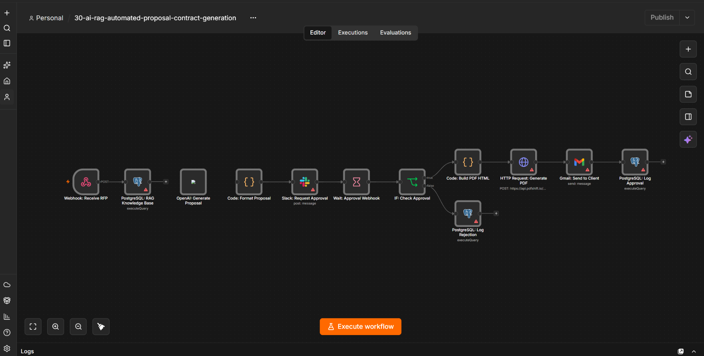

# 30 - AI RAG Automated Proposal & Contract Generation (Grand Finale)


## Description

This advanced reference workflow demonstrates a **Retrieval-Augmented Generation (RAG)** pipeline for B2B proposal operations. It retrieves approved templates, pricing tiers, and case studies from a PostgreSQL knowledge base to ground the draft and reduce unsupported model output. A Slack-based **Human-in-the-Loop Approval** step gates delivery, after which a third-party API can generate the PDF and trigger follow-up actions. The workflow is designed to reduce manual drafting effort, but actual time savings, accuracy, and cost must be measured with representative RFPs in a controlled pilot.


## Nodes Used

- **Webhook: Receive RFP**: Receives incoming proposal requests (client name, industry, budget, requirements) from a web form or CRM.

- **PostgreSQL: RAG Knowledge Base**: Acts as the "Source of Truth." Queries the database to retrieve the most relevant proposal template, pricing tier, and case study based on the client's industry and service needs.

- **OpenAI: Generate Proposal**: Uses the retrieved knowledge base data to generate a comprehensive, multi-section proposal (Executive Summary, Solution, Timeline, Pricing) in clean Markdown format.

- **Code: Format Proposal**: Processes the AI output, adds metadata (timestamps, RFP IDs), and prepares the data for the approval stage.

- **Wait: Approval Webhook**: Pauses the workflow and generates a unique callback URL, waiting for the human approver to make a decision.

- **Slack: Request Approval**: Sends an interactive message to the Sales Manager with a preview of the proposal and clickable "Approve" / "Reject" buttons linked to the Wait node's webhook.

- **IF: Check Approval**: Evaluates the decision returned by the webhook (Approve vs. Reject).

- **HTTP Request: Generate PDF**: Sends the approved Markdown content to a service like PDFShift or HTML2PDF to generate a professional, branded PDF document.

- **Gmail: Send to Client**: Delivers the final PDF proposal to the client with a personalized, professional email.

- **PostgreSQL: Log Decision**: Records the final decision (Approved/Rejected) and timestamp in an audit table for compliance and tracking.


## Workflow Diagram




## How It Works

1. **Ingestion**: A client submits an RFP via a web form, triggering the Webhook with their details (industry, budget, requirements).

2. **RAG Retrieval**: The system queries the PostgreSQL Knowledge Base to find the exact template, pricing model, and relevant case study for that specific industry.

3. **AI Generation**: OpenAI uses the retrieved data (not just its pre-trained knowledge) to draft a highly specific, accurate proposal in Markdown format.

4. **Human-in-the-Loop**: The draft is sent to the Sales Manager via Slack. The workflow pauses (Wait node) until the manager clicks "Approve" or "Reject".

5. **Document Conversion**: Upon approval, the Markdown is sent to a PDF generation API to create a polished, ready-to-sign document.

6. **Delivery**: The PDF is emailed directly to the client.

7. **Audit**: The decision and outcome are logged in the database for future reference and performance tracking.


## How to Use

1. Import the `workflow.json` file into your n8n instance.

2. Set up the PostgreSQL database with the `knowledge_base` and `proposal_decisions` tables.

3. Populate the `knowledge_base` with your actual templates, pricing, and case studies.

4. Configure all credentials (PostgreSQL, OpenAI, Slack, PDFShift/HTML2PDF, Gmail).

5. Test the workflow by submitting a mock RFP via the Webhook.

6. Verify the Slack message appears and test the approval links.

7. Activate the workflow for production use.


## Prerequisites

- A running instance of n8n (Cloud or Self-hosted).

- PostgreSQL database for the Knowledge Base and audit logging.

- OpenAI API key (GPT-4o recommended for long-form, high-quality writing).

- A PDF generation service account (e.g., PDFShift, HTML2PDF, or DocRaptor).

- Slack workspace with a dedicated sales review channel.

- Gmail account for client communication.


## Setup Steps

1. **PostgreSQL Setup**: Create the Knowledge Base and audit tables:

   ```sql

   CREATE TABLE knowledge_base (

       id SERIAL PRIMARY KEY,

       industry VARCHAR(100),

       service_type VARCHAR(100),

       proposal_template TEXT,

       pricing_tier TEXT,

       case_study TEXT

   );


   CREATE TABLE proposal_decisions (

       id SERIAL PRIMARY KEY,

       rfp_id VARCHAR(100),

       client_name VARCHAR(100),

       decision VARCHAR(50),

       decided_at TIMESTAMP DEFAULT NOW()

   );


   -- Insert sample data

   INSERT INTO knowledge_base (industry, service_type, proposal_template, pricing_tier, case_study)

   VALUES ('Healthcare', 'Software Dev', '## Executive Summary\\nWe propose...', 'Tier 2: $50k-$100k', 'Case: MedTech Portal...');

   ```

2. **Credentials**: Add your PostgreSQL, OpenAI, Slack, PDF API (Header Auth), and Gmail credentials in n8n.

3. **Node Configuration**:

   - Update the `PostgreSQL: RAG Knowledge Base` query to match your schema.

   - Refine the OpenAI system prompt to match your company's brand voice and proposal structure.

   - Update the Slack channel ID to your sales review channel.

   - Configure the HTTP Request node with your chosen PDF generation API endpoint and key.

4. **Activation**: Save and activate the workflow to generate the production Webhook and Approval Callback URLs.


## Credentials Required

- **PostgreSQL API**: Host, Database, User, Password.

- **OpenAI API**: API Key for GPT-4o.

- **Slack API**: Bot User OAuth Token with `chat:write` permissions.

- **HTTP Header Auth**: API Key for your PDF generation service (e.g., PDFShift).

- **Gmail OAuth2**: For sending the final proposal to clients.


## Use Cases

- **B2B Service Agencies**: Automating the creation of custom proposals for software development, marketing, or consulting firms.

- **Freelancers & Consultants**: Quickly generating professional contracts and quotes for new leads.

- **Enterprise Sales Teams**: Providing sales reps with instant, accurate draft proposals to accelerate the sales cycle.

- **RFP Response Teams**: Automating the first draft of complex RFP responses by pulling from a centralized knowledge base.


## Customization Ideas

- **DocuSign Integration**: Replace the PDF generation + Email step with a DocuSign API call to send the proposal for electronic signature directly.

- **Vector Database (Pinecone/Weaviate)**: Upgrade the PostgreSQL RAG to a true Vector Database for semantic search across thousands of past proposals.

- **Multi-Language Support**: Detect the client's language from the RFP and generate the proposal in their native language.

- **CRM Sync**: Automatically create an Opportunity in HubSpot or Salesforce when a proposal is generated or approved.

- **Automated Follow-up**: Add a Wait node (48 hours) after sending the email, followed by a check to see if the client opened it, and send a polite follow-up if not.


## Notes

- **RAG Importance**: The Retrieval step is critical. Without it, the AI will "hallucinate" pricing and case studies. Always ensure the Knowledge Base is kept up-to-date.

- **Interactive Approval**: The `Wait` node in n8n is powerful but requires the workflow to remain active. For long-running approvals (days/weeks), consider using a database state machine triggered by a separate Webhook instead of a long-running Wait node.

- **PDF APIs**: Most PDF generation APIs have rate limits or costs per conversion. For high volumes, consider self-hosting an open-source alternative like Gotenberg or Puppeteer.

- **Prompt Engineering**: The quality of the proposal depends heavily on the system prompt. Spend time refining the instructions to ensure the AI uses the retrieved data correctly and maintains the right tone.


## Troubleshooting

- **AI Hallucinations**: If the proposal contains fake pricing or case studies, check the PostgreSQL query. Ensure it's returning the correct data and that the OpenAI prompt explicitly instructs it to "ONLY use the provided knowledge base data."

- **Slack Buttons Not Working**: Ensure the Webhook URLs in the Slack message are correctly formatted and that the `Wait` node is configured to listen for the correct query parameters (`?decision=approve`).

- **PDF Generation Fails**: Check the API documentation of your PDF service. Some require HTML input instead of Markdown. You may need to add a Markdown-to-HTML conversion step in the Code node.

- **Long-Running Wait Timeouts**: If the approval takes too long, the n8n execution might time out. For production, implement a "Callback Webhook" pattern where the Slack button hits a separate Webhook that updates a database status, rather than relying on a single long-running execution.


## License

This project is licensed under the MIT License.
