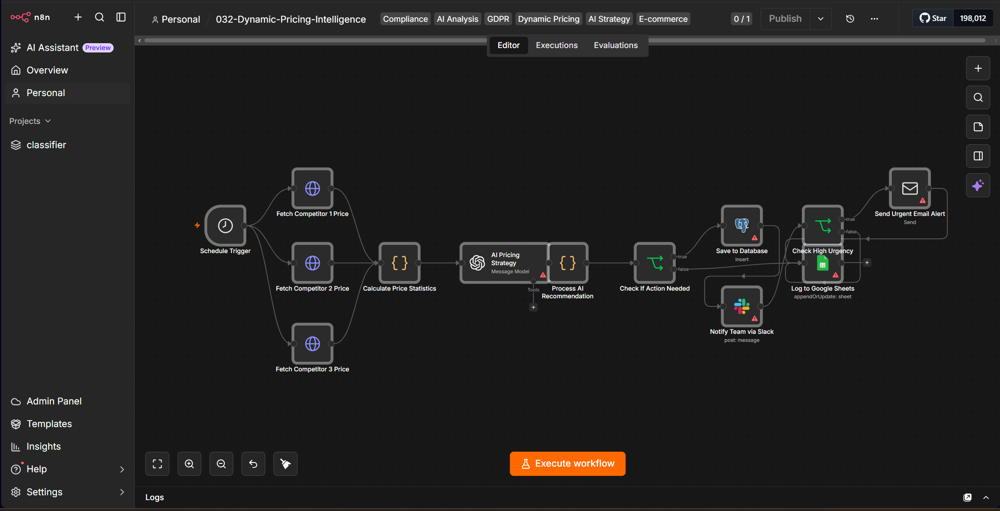

# 32 — Dynamic Pricing Intelligence & AI Strategist


An n8n-based pricing-intelligence workflow that periodically queries competitor-price endpoints, derives market statistics, asks GPT-4 for a structured pricing recommendation, applies deterministic action/urgency thresholds, and routes the result to PostgreSQL, Slack, email, and Google Sheets.

> **Scope:** this project demonstrates a pricing-decision orchestration pattern. It does **not** automatically change a live product price, and the current workflow still has orchestration gaps that should be resolved before production use.

## Business Problem

Pricing teams often need to combine multiple signals before deciding whether a product price should move:

- competitor prices,
- competitor availability,
- current internal price,
- stock level,
- target margin,
- market dispersion,
- operational urgency.

The value of this workflow is not "AI changes prices automatically." Instead, it separates the process into two layers:

1. **deterministic data processing** for statistics, thresholds, and routing,
2. **AI-assisted recommendation** for interpretation and strategy.

That separation makes the decision path easier to inspect and safer to evolve.

## Workflow Preview



## Intended Architecture

```text
                     ┌──────────────────────┐
                     │ Schedule Trigger     │
                     │ every 6 hours        │
                     └──────────┬───────────┘
                                │
            ┌───────────────────┼───────────────────┐
            │                   │                   │
            ▼                   ▼                   ▼
┌────────────────────┐ ┌────────────────────┐ ┌────────────────────┐
│ Competitor 1 API   │ │ Competitor 2 API   │ │ Competitor 3 API   │
└──────────┬─────────┘ └──────────┬─────────┘ └──────────┬─────────┘
           │                      │                      │
           └──────────────┬───────┴──────────────┬───────┘
                          ▼                      │
                 ┌──────────────────────┐        │
                 │ Aggregate Responses  │◄───────┘
                 └──────────┬───────────┘
                            ▼
                 ┌──────────────────────┐
                 │ Calculate Statistics │
                 └──────────┬───────────┘
                            ▼
                 ┌──────────────────────┐
                 │ GPT-4 Recommendation │
                 └──────────┬───────────┘
                            ▼
                 ┌──────────────────────┐
                 │ Deterministic        │
                 │ Threshold Logic      │
                 └──────────┬───────────┘
                            ▼
                    ┌───────────────┐
                    │ Action > 2% ? │
                    └──────┬───┬────┘
                         yes   no
                          │     │
                          ▼     ▼
             ┌────────────────┐ ┌────────────────┐
             │ DB + Slack     │ │ Google Sheets  │
             └───────┬────────┘ └────────────────┘
                     ▼
               ┌─────────────┐
               │ Urgency high│
               └─────┬───┬───┘
                   yes   no
                    │     │
                    ▼     ▼
               Email    Sheets
```

The diagram above represents the **intended** aggregation design. The current exported workflow needs an explicit join/merge step before statistics are calculated; see the reliability review below.

## Current Decision Flow

The workflow currently applies these decision rules after the AI response:

| Rule | Current behavior |
|---|---|
| Action threshold | `abs(priceChangePercent) > 2` |
| Medium urgency | absolute change greater than 5% |
| High urgency | absolute change greater than 10% |
| High urgency delivery | urgent email after Slack notification |
| No-action delivery | Google Sheets logging |
| Action history | PostgreSQL insert before team notification |

The AI proposes a price and strategy, but the workflow itself determines whether the result qualifies as actionable and how urgent it is.

## Data Model Produced by the Statistics Step

The statistics node is designed to produce an object similar to:

```json
{
  "productId": "PROD-001",
  "currentPrice": 99.99,
  "stockLevel": 100,
  "targetMargin": 0.25,
  "competitorAnalysis": {
    "prices": [95.0, 101.5, 98.0],
    "average": 98.17,
    "minimum": 95.0,
    "maximum": 101.5,
    "median": 98.0,
    "stdDeviation": 2.66,
    "competitorCount": 3,
    "competitorsInStock": 3
  },
  "marketPosition": "above_market",
  "priceGap": "1.85"
}
```

This is the structured market context sent to the model.

## AI Recommendation Contract

The OpenAI node requests JSON with these fields:

```json
{
  "recommended_price": 97.99,
  "strategy": "neutral",
  "confidence_score": 78,
  "reasoning": "Example explanation",
  "risk_factors": [
    "Competitor data may be stale"
  ],
  "action": "decrease"
}
```

The next Code node parses that response and calculates the actual percentage change and urgency.

The model recommendation is therefore **advisory input**. It is not a direct write to a commerce platform.

## Repository Layout

```text
32-dynamic-pricing-intelligence/
├── .env.example
├── README.md
├── screenshots/
│   └── workflow-view.png
└── workflows/
    └── workflow.json
```

## Nodes Used

| Node | Purpose |
|---|---|
| `Schedule Trigger` | starts the process every six hours |
| `HTTP Request` ×3 | retrieves competitor-price data |
| `Code` | calculates price statistics |
| `OpenAI` | generates pricing recommendation JSON |
| `Code` | parses recommendation and applies thresholds |
| `IF` | checks whether action is needed |
| `Postgres` | stores actionable recommendations |
| `Slack` | sends team pricing alert |
| `IF` | checks high urgency |
| `Email Send` | sends urgent pricing email |
| `Google Sheets` | records final decision output |

## Setup

### 1. Import the workflow

In n8n:

```text
Workflows → Import from File
```

Import:

```text
workflows/workflow.json
```

### 2. Configure environment values

Use `.env.example` as the reference:

```env
COMPETITOR1_API_KEY=your_competitor1_api_key
COMPETITOR2_API_TOKEN=your_competitor2_bearer_token
COMPETITOR3_API_KEY=your_competitor3_api_key

SLACK_CHANNEL=#pricing-alerts
PRICE_ALERT_EMAIL=manager@yourcompany.com

DB_HOST=localhost
DB_PORT=5432
DB_NAME=pricing_db
DB_USER=postgres
DB_PASSWORD=your_password
```

The database values are optional if PostgreSQL is configured entirely through n8n credentials.

### 3. Replace placeholder integrations

The current workflow uses placeholder competitor endpoints:

```text
api.competitor1.com
api.competitor2.com
api.competitor3.com
```

Replace these with real, authorized data sources and update field mappings to match their response schemas.

### 4. Configure n8n credentials

Replace placeholder credential references for:

- OpenAI,
- PostgreSQL,
- Slack,
- SMTP,
- Google Sheets OAuth2.

### 5. Configure Google Sheets

Replace:

```text
REPLACE_WITH_YOUR_SHEET_ID
```

and ensure the target sheet contains columns compatible with:

- Product ID
- Current Price
- Recommended Price
- Change %
- Strategy
- Confidence
- Action
- Urgency
- Timestamp

## PostgreSQL Schema

A schema compatible with the current database node is:

```sql
CREATE TABLE pricing_history (
    id SERIAL PRIMARY KEY,
    product_id VARCHAR(50) NOT NULL,
    current_price DECIMAL(10, 2),
    recommended_price DECIMAL(10, 2),
    price_change_percent DECIMAL(5, 2),
    strategy VARCHAR(20),
    confidence INT,
    action VARCHAR(20),
    urgency VARCHAR(10),
    competitor_avg DECIMAL(10, 2),
    analyzed_at TIMESTAMP DEFAULT CURRENT_TIMESTAMP
);
```

## Important Reality Check: Product Context

The Schedule Trigger does not itself create business fields such as:

```text
productId
currentPrice
stockLevel
targetMargin
```

The current Code node therefore falls back to hard-coded defaults when those values are missing:

```text
productId    → PROD-001
currentPrice → 99.99
stockLevel   → 100
targetMargin → 0.25
```

For a real deployment, insert an upstream product-data source or loop over a product catalog before competitor requests are made.

## Reliability Review

### 1. The three competitor branches are not explicitly merged

This is the most important architectural limitation in the current export.

All three HTTP Request nodes connect directly to `Calculate Price Statistics`. In n8n, multiple incoming branches should not be assumed to behave as a synchronized fan-in that waits for all three responses.

The current statistics code expects:

```js
$input.all()
```

to contain the combined competitor responses, but the graph does not contain an explicit Merge/Aggregate synchronization node.

A production-safe design should:

1. fetch competitor data,
2. wait for the required branches,
3. merge the responses into one collection,
4. calculate statistics once.

Without that explicit aggregation barrier, the workflow can calculate statistics from incomplete data or execute the downstream path more than once.

### 2. Median calculation is simplified

The current code uses:

```js
prices.sort((a, b) => a - b)[Math.floor(prices.length / 2)]
```

That returns the center element for odd-sized arrays, but for an even number of competitors it returns the upper-middle value rather than the conventional average of the two middle values.

This is acceptable for the current three-source example, but should be corrected if the design becomes generic.

### 3. Empty or invalid price arrays are not guarded

If all competitor responses contain missing or non-numeric prices, calculations such as:

```text
average
minimum
maximum
variance
```

can become invalid.

Add a minimum-data-quality gate before invoking AI.

### 4. API failures are not modeled as market data quality

A failed competitor request should not silently reduce confidence in the same way as a legitimate missing competitor.

Production implementations should retain:

- fetch status,
- source timestamp,
- response latency,
- staleness,
- currency,
- validation state.

### 5. No currency normalization exists

Each competitor object stores a `currency`, but the statistical calculation uses the numeric `price` values directly.

If sources return mixed currencies, the resulting average and recommendation would be invalid.

Normalize all prices into one canonical currency before aggregation.

### 6. AI output is parsed without schema validation

The workflow calls:

```js
JSON.parse(...)
```

and then trusts fields such as:

- `recommended_price`,
- `confidence_score`,
- `strategy`,
- `action`.

A stronger design should validate type, range, and allowed values before applying downstream logic.

### 7. Logging is asymmetric

Actionable recommendations are inserted into PostgreSQL. Non-action recommendations go directly to Google Sheets.

That means PostgreSQL does not currently represent a complete history of every pricing evaluation.

If historical analysis matters, persist every decision event with an `action_required` flag.

## Safety Controls for Real Pricing Systems

A production pricing platform should add hard deterministic guardrails around the AI recommendation.

Examples:

- minimum allowed gross margin,
- maximum percentage movement per decision,
- minimum and maximum absolute price,
- MAP/MSRP constraints where applicable,
- inventory floor/ceiling rules,
- promotion exclusions,
- currency validation,
- stale-data rejection,
- required human approval above a risk threshold.

A recommended architecture is:

```text
Market Data
   ↓
Deterministic Validation
   ↓
AI Recommendation
   ↓
Deterministic Guardrails
   ↓
Human Approval / Pricing Service
```

The LLM should not be the final authority for revenue-critical price changes.

## Security and Responsible Use

- Never commit real API tokens or credentials.
- Use only competitor data sources you are authorized to access.
- Respect provider terms, request limits, and data-use restrictions.
- Treat external API content as untrusted input.
- Do not expose confidential margin or inventory data in broad Slack channels.
- Keep write access to production pricing systems separate from recommendation workflows.
- Audit who approved any actual price change.

## Testing Checklist

Before relying on this workflow, test at least these scenarios:

- all three competitors return valid USD prices,
- one competitor is unavailable,
- two competitors are unavailable,
- all price fields are invalid,
- one source returns another currency,
- competitor price is zero or negative,
- current price is zero,
- AI returns malformed JSON,
- AI returns a non-numeric recommended price,
- recommendation is exactly 2%,
- recommendation is exactly 5%,
- recommendation is exactly 10%,
- database insert fails,
- Slack delivery fails,
- urgent email fails,
- Google Sheets append/update fails.

Also verify that one schedule execution creates **one final recommendation per product**, not one recommendation per competitor branch.

## Production Hardening Roadmap

A stronger next version should add:

1. a real product catalog/input source,
2. explicit Merge/Aggregate fan-in,
3. configurable competitor registry,
4. schema validation per competitor source,
5. currency normalization,
6. freshness and source-quality scoring,
7. robust median/statistical utilities,
8. deterministic pricing guardrails,
9. structured AI-output validation,
10. complete decision-event persistence,
11. retries/backoff for external APIs,
12. observability and correlation IDs,
13. approval workflow for high-risk recommendations,
14. automated tests for decision thresholds.

## Engineering Trade-offs

### Parallel competitor requests

**Advantage:** lower total collection latency.

**Trade-off:** parallel fan-out requires an explicit and reliable fan-in strategy before aggregate calculations.

### AI-assisted recommendation

**Advantage:** can synthesize several market signals into a readable strategic recommendation.

**Trade-off:** model output is probabilistic and should be bounded by deterministic business rules.

### Six-hour schedule

**Advantage:** simple and cost-conscious for a portfolio workflow.

**Trade-off:** this is periodic monitoring, not true real-time pricing intelligence.

## Design Summary

This project demonstrates a strong pricing-automation concept: collect market signals, calculate deterministic metrics, use AI for interpretation, and then apply deterministic thresholds for routing.

Its most important next improvement is architectural rather than cosmetic: introduce a proper product-data source and explicit competitor-response aggregation before calculating market statistics.

With those changes, plus currency normalization, validation, persistence, and hard pricing guardrails, the workflow can evolve from a portfolio reference into a much more defensible production design.

## License

This project is proprietary and intended for internal use or authorized clients. © 2026.
