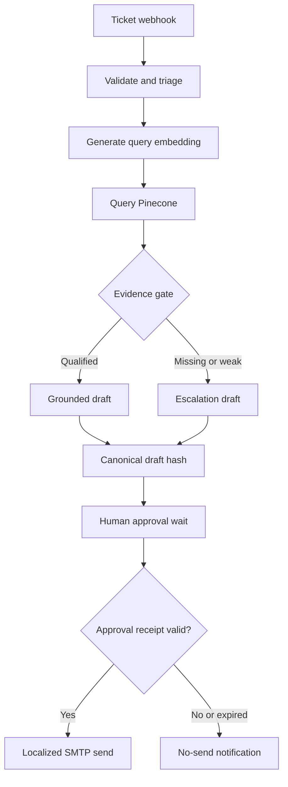

# AI Multilingual Customer Support with Auditable RAG


An n8n reference implementation for multilingual support triage, evidence-gated retrieval, human-authorized outbound replies, CRM tracking, and tamper-evident audit records.

The workflow does **not** equate a fluent answer with a grounded answer. A reply is marked `GROUNDED` only after a real query embedding is generated, Pinecone returns usable evidence above the configured score threshold, and the retrieval provenance is persisted. Every outbound email is blocked until a reviewer approves the exact canonical draft.

## Business problem

Multilingual support automation creates two independent risks:

1. A model can produce a plausible response without reliable supporting evidence.
2. A generated draft can be sent without a durable record of who authorized that exact version.

This project addresses both boundaries explicitly. Retrieval evidence controls whether the model may draft a grounded answer, while a separate approval state machine controls whether any draft may leave the organization.

## Architecture



Retrieval, approval, and send events are written to a local append-only audit sink. Every stored record includes the previous record's hash, producing a tamper-evident chain.

## Trust boundaries

| Boundary | Required evidence | Fail-closed behavior |
|---|---|---|
| Ticket intake | Required fields, valid email, bounded content | Stop execution |
| Retrieval | Real embedding, usable matches, score threshold | Create escalation draft |
| Grounding | Qualified evidence IDs and provenance receipt | Never label grounded |
| Human authority | Reviewer, exact draft hash, decision, expiry | Do not send |
| SMTP | Persisted approval receipt | SMTP remains unreachable |
| Audit | Authenticated event and successful append | Stop before protected action |

## Workflow states

```text
RECEIVED
  → TRIAGED
  → EVIDENCE_EVALUATED
  → APPROVAL_REQUIRED
  → APPROVED | REJECTED | EXPIRED
  → APPROVED_FOR_SEND
  → SENT
```

There is no connection from the rejected or expired branch to SMTP.

## Key controls

### Real query embedding

`Generate Query Embedding` calls the OpenAI embeddings endpoint with the configured model and dimensions. `Query Pinecone with Real Embedding` passes that vector directly to the index. The previous synthetic zero-vector fallback has been removed.

The query model and dimensions must match the model and dimensions used to index the knowledge base.

### Evidence gate

Pinecone matches are normalized into evidence records containing:

- document ID;
- similarity score;
- source label;
- content hash supplied during ingestion;
- bounded text used for generation.

At least one usable match must meet `RETRIEVAL_SCORE_THRESHOLD`. Otherwise the system builds a multilingual escalation response instead of inventing an answer. An angry sentiment independently marks the case for escalation even when evidence is present.

Similarity score is only one retrieval signal. Tune the threshold with a labeled evaluation set before deployment; `0.72` is a configuration example, not a universal quality guarantee.

### Prompt-injection boundary

Both ticket content and retrieved passages are treated as untrusted data. The generation prompt instructs the model to ignore instructions embedded in retrieved content and to use only qualified evidence. This reduces risk but does not prove prompt-injection resistance; adversarial evaluation and input/output policy controls remain necessary in a real deployment.

### Exact-draft approval

`Prepare Draft & Approval` canonicalizes the ticket ID, recipient, subject, body, and closing, then calculates a SHA-256 hash. The workflow posts the draft, evidence IDs, expiry, hash, and signed one-time resume URL to Slack.

The execution pauses at `Wait for Approval`. Approval is valid only when:

- the callback has not expired;
- a reviewer identity is supplied;
- the decision is `approved`;
- the submitted draft hash exactly matches the pending draft hash.

Any content change invalidates the approval. See [the approval callback contract](docs/approval-contract.md).

### Retrieval and approval provenance

Before generation, the audit sink records:

- ticket and execution IDs;
- embedding model and dimensions;
- retrieval threshold and grounding status;
- evidence IDs, scores, sources, and content hashes.

Before branch evaluation, it records the approval receipt. After SMTP succeeds, it records the sent receipt. The raw embedding vector is intentionally not stored by default; the model configuration, execution identity, and retrieved evidence provide a smaller and safer operational record.

### Multilingual email envelope

The model returns `subject`, `body`, and `closing` in the detected language. The final HTML wrapper contains no fixed English greeting, escapes untrusted HTML characters, and uses right-to-left direction for Persian, Arabic, Hebrew, and Urdu.

## Project structure

```text
35-ai-multilingual-support-rag/
├── docs/
│   └── approval-contract.md
├── scripts/
│   ├── audit-server.mjs
│   └── build-workflow.mjs
├── tests/
│   ├── policy.test.mjs
│   └── validate-workflow.mjs
├── workflows/
│   └── workflow.json
├── .env.example
├── .gitignore
├── package.json
└── README.md
```

## Prerequisites

- Node.js 20 or later for generation, validation, tests, and the local audit sink
- n8n with the OpenAI LangChain node available
- OpenAI credentials for classification, embedding, and drafting
- a Pinecone index populated with text, source, and `content_hash` metadata
- a restricted Slack review channel
- HubSpot private-app access
- an SMTP credential configured in n8n

The included audit sink uses only Node.js built-ins and can run locally without a paid service.

## Configuration

Copy `.env.example` to `.env` and replace every placeholder. Important settings:

| Variable | Purpose |
|---|---|
| `EMBEDDING_MODEL` | Must match knowledge-base ingestion |
| `EMBEDDING_DIMENSIONS` | Must match the Pinecone index |
| `PINECONE_INDEX_HOST` | Full index host, not the legacy project/environment URL |
| `RETRIEVAL_SCORE_THRESHOLD` | Minimum score for qualified evidence |
| `APPROVAL_TTL_HOURS` | Maximum reviewer decision window |
| `AUDIT_SINK_URL` | Reachable audit service base URL |
| `AUDIT_SINK_TOKEN` | Random bearer token with at least 16 characters |

The Code nodes use Node's built-in `crypto` module. Self-hosted n8n deployments must allow it with `NODE_FUNCTION_ALLOW_BUILTIN=crypto`.

## Run the audit sink

```bash
npm run audit:start
```

By default it listens on `127.0.0.1:8787` and appends records to `data/audit.ndjson` with file mode `0600`. If n8n runs in a container, expose the service only on a trusted internal network and set `AUDIT_SINK_URL` to the address reachable from that container.

Health check:

```bash
curl http://127.0.0.1:8787/health
```

## Import and configure n8n

1. Run `npm test` locally.
2. Import `workflows/workflow.json` into n8n.
3. Select the real OpenAI, Slack, and SMTP credentials in their nodes.
4. expose the environment variables from `.env.example` to n8n.
5. Verify that the Pinecone knowledge base contains `text`, `source`, and `content_hash` metadata.
6. Start the audit sink and confirm its health endpoint from the n8n runtime.
7. Activate the workflow and submit a test ticket.

Sample ticket:

```json
{
  "ticket_id": "TKT-9982",
  "idempotency_key": "support-TKT-9982-v1",
  "customer_email": "maria.garcia@example.com",
  "customer_name": "Maria Garcia",
  "content": "Hola, no puedo cancelar mi suscripción desde el panel."
}
```

The webhook returns `202` immediately. Processing continues asynchronously and blocks at the approval wait node.

## Verification

```bash
npm test
```

The verification suite:

- regenerates the importable workflow deterministically;
- parses and validates workflow JSON;
- checks unique node names and IDs;
- verifies every node is reachable;
- detects dangling connections;
- forbids the synthetic zero-vector fallback;
- verifies the embedding, evidence, approval, audit, and SMTP gates exist;
- confirms every referenced environment variable is documented;
- tests empty, weak, and qualified retrieval outcomes;
- tests approval, hash mismatch, missing reviewer, and expiry outcomes;
- starts the audit server and verifies its hash-chain linkage.

## Failure behavior

| Failure | Result |
|---|---|
| Invalid ticket payload | Execution stops before model calls |
| Embedding or Pinecone unavailable after retries | Execution fails; no email is sent |
| No qualified evidence | Escalation draft requiring approval |
| Audit sink unavailable | Protected action does not continue |
| Missing reviewer or wrong draft hash | `REJECTED`; no email |
| Approval timeout | `EXPIRED`; no email |
| SMTP failure | No sent receipt is written |
| Rejected approval | Slack no-send notification |

## Production-readiness boundary

This repository is a production-oriented reference, not a turnkey production claim. Before a live rollout, add:

- authenticated reviewer identity from Slack signatures, SSO, or an internal approval application;
- an idempotency store with a unique constraint on `idempotencyKey`;
- organization-specific authorization and data-retention rules;
- PII redaction and regional data-processing controls;
- retrieval evaluation with a labeled multilingual dataset;
- model, prompt-injection, and email-delivery observability;
- HubSpot custom properties aligned with the target portal's pipeline schema;
- disaster recovery for the audit log and n8n execution database.

The current workflow validates and carries an idempotency key but deliberately does not pretend that a durable uniqueness guarantee exists without a configured database.

## Security notes

- Never commit `.env`, n8n credentials, audit logs, or customer data.
- Restrict the Slack review channel and audit service network path.
- Rotate the audit bearer token and external service credentials.
- Do not log raw embeddings or unnecessary ticket content.
- Treat knowledge-base metadata and passages as untrusted input.
- Back up and independently verify the audit chain.

## License

This project is proprietary and intended for internal use or authorized clients. © 2026.
