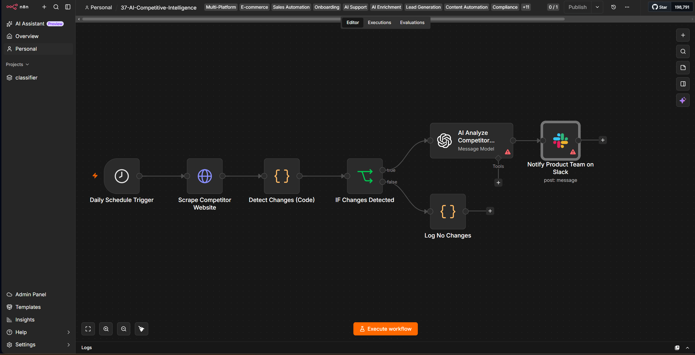

# 37 — AI Competitive Intelligence & Market Trend Analyzer


An n8n-based competitive-intelligence workflow that checks a competitor page every 24 hours, normalizes the returned HTML into a text snapshot, compares it with the previous snapshot, sends changed content to GPT-4 for structured analysis, and posts the resulting intelligence to Slack.

> **Scope:** this repository demonstrates the end-to-end automation pattern. It is intentionally lightweight and uses n8n workflow static data rather than an external history store. The production-hardening section below explains what should change before using the design for multi-competitor or business-critical monitoring.

## Business Problem

Competitive monitoring is often performed manually: someone revisits pricing, product, or messaging pages, notices a change, interprets it, and then informs the team. That process is slow, inconsistent, and difficult to audit.

This project automates the first-response loop:

1. collect a competitor page on a schedule,
2. detect whether the normalized snapshot changed,
3. ask an LLM to explain the observed difference,
4. route the structured result to the product team,
5. remain quiet when the snapshot is unchanged.

The workflow is useful as a portfolio example of combining deterministic change detection with AI-assisted interpretation rather than asking an LLM to perform every step.

## Workflow Preview



## Architecture

```text
┌──────────────────────────┐
│ Daily Schedule Trigger   │
│ every 24 hours           │
└────────────┬─────────────┘
             │
             ▼
┌──────────────────────────┐
│ HTTP Request             │
│ COMPETITOR_URL           │
└────────────┬─────────────┘
             │
             ▼
┌──────────────────────────┐
│ Detect Changes (Code)    │
│ - strip HTML tags        │
│ - collapse whitespace    │
│ - keep first 5,000 chars │
│ - compare static data    │
└────────────┬─────────────┘
             │
             ▼
      ┌───────────────┐
      │ Has changed?  │
      └──────┬───┬────┘
             │   │
           yes   no
             │   │
             ▼   ▼
┌───────────────────────┐   ┌────────────────────┐
│ GPT-4 analysis        │   │ Log No Changes     │
│ structured JSON       │   │ end quietly        │
└────────────┬──────────┘   └────────────────────┘
             │
             ▼
┌───────────────────────┐
│ Slack notification    │
│ product-team alert    │
└───────────────────────┘
```

## Data Flow

The current implementation uses one text snapshot as its comparison baseline.

| Stage | Input | Processing | Output |
|---|---|---|---|
| Schedule | time | run every 24 hours | execution |
| Fetch | `COMPETITOR_URL` | HTTP GET | raw HTML/text response |
| Normalize | page response | remove tags, collapse whitespace, truncate to 5,000 chars | normalized snapshot |
| Compare | current + previous snapshot | strict string inequality | `hasChanges` |
| Analyze | previous + current snapshot | GPT-4 prompt with JSON response format | summary, changes, implication, action |
| Notify | parsed AI response | Slack formatting | team alert |

The previous snapshot is stored with:

```js
getWorkflowStaticData('global')
```

This keeps the example self-contained, but it does **not** provide a durable multi-competitor audit history.

## Nodes Used

| Node | Role |
|---|---|
| `Schedule Trigger` | starts the workflow every 24 hours |
| `HTTP Request` | retrieves the configured competitor page |
| `Code` — Detect Changes | normalizes content, compares baseline, updates static data |
| `IF` | routes changed vs. unchanged executions |
| `OpenAI` | analyzes the observed content difference |
| `Slack` | sends the formatted intelligence alert |
| `Code` — Log No Changes | terminates the no-change path with a simple log object |

## Repository Layout

```text
37-ai-competitive-intelligence/
├── .env.example
├── README.md
├── screenshots/
│   └── workflow-view.png
└── workflows/
    └── workflow.json
```

## Setup

### 1. Import the workflow

In n8n:

```text
Workflows → Import from File
```

Import:

```text
workflows/workflow.json
```

### 2. Configure environment values

Use `.env.example` as the reference:

```env
COMPETITOR_URL=https://competitor.com/pricing
SLACK_INTELLIGENCE_CHANNEL=#competitive-intelligence
```

Choose a stable public page that is appropriate to monitor.

### 3. Configure credentials

The exported workflow contains placeholder credential references. Replace them in n8n with your own credentials for:

- OpenAI
- Slack

The Slack integration needs permission to post to the configured channel.

### 4. Run a manual test

Run the workflow manually before enabling the schedule and inspect the output of each node.

Because the implementation initializes the missing baseline as `"No previous data"`, the first execution is expected to be treated as a change. In other words, the first run is not a silent seed operation in the current workflow.

### 5. Activate the schedule

After validating the fetch, AI response, and Slack message, activate the workflow.

## Example AI Contract

The OpenAI node is instructed to return a JSON object with this shape:

```json
{
  "summary": "Competitor X added a new enterprise plan.",
  "key_changes": [
    "A new enterprise pricing tier appeared",
    "AI capabilities received more prominent positioning"
  ],
  "strategic_implication": "The competitor may be moving further upmarket.",
  "recommended_action": "Review positioning and validate whether the change affects the target segment."
}
```

The example above demonstrates the expected schema. The actual analysis depends on the page content supplied to the model and should be treated as an AI-generated interpretation, not a verified statement of competitor intent.

## What the Workflow Detects — and What It Does Not

### Implemented

- scheduled HTTP retrieval,
- HTML-tag removal,
- whitespace normalization,
- comparison against the previous stored snapshot,
- branch-on-change logic,
- structured GPT-4 analysis,
- Slack delivery.

### Not implemented

- semantic or percentage-based change thresholds,
- DOM-aware element targeting,
- JavaScript rendering,
- multi-page crawling,
- multi-competitor state isolation,
- persistent change history,
- source screenshots or evidence capture,
- retries/backoff and dead-letter handling,
- human approval before downstream actions,
- automated tests.

This distinction matters: the current `hasChanges` decision is based on **exact inequality of the normalized text snapshot**, not on whether a change is strategically meaningful.

## Important Engineering Trade-offs

### 1. Static data vs. external database

**Current choice:** n8n workflow static data.

Advantages:

- minimal setup,
- no database dependency,
- useful for demonstrating the pattern.

Limitations:

- one global baseline in this workflow,
- poor fit for historical analytics,
- no normalized event/audit model,
- harder to support many competitors safely.

For a larger system, use PostgreSQL or another persistent store keyed by competitor, URL, capture time, and content hash.

### 2. Simple text extraction vs. DOM-aware parsing

The workflow strips HTML with a regular expression and keeps only the first 5,000 characters.

Advantages:

- simple,
- fast,
- inexpensive.

Limitations:

- navigation, cookie banners, timestamps, or rotating content can produce false positives,
- relevant changes beyond the first 5,000 characters are ignored,
- page structure is lost.

A stronger implementation would target stable DOM sections and hash normalized sections independently.

### 3. Deterministic detection vs. AI interpretation

The workflow uses deterministic comparison to decide whether to invoke AI. This is preferable to asking the model whether two pages are identical because the detection step is cheap and reproducible.

The LLM is used where judgment is more useful: summarizing the difference and suggesting questions or actions for a human team to review.

## Reliability Notes

There is an important sequencing behavior in the current workflow: the new snapshot is written to static data inside the change-detection node **before** the downstream OpenAI and Slack steps finish.

Therefore, if AI analysis or Slack delivery fails after the baseline has already advanced, the next scheduled execution may see the same page as unchanged and will not automatically replay the missed alert.

For a production design, update the committed baseline only after the downstream path succeeds, or persist executions/events separately with retry state.

Other recommended reliability controls:

- HTTP timeout and retry policy,
- exponential backoff for 429/5xx responses,
- content hash logging,
- execution correlation IDs,
- alerting on repeated fetch failures,
- schema validation before parsing the AI response,
- fallback handling for malformed model output.

## Security and Responsible Use

- Do not commit API keys or Slack tokens to the repository.
- Keep credentials in n8n's credential store or approved secret management.
- Only monitor pages you are authorized and legally permitted to access.
- Respect website terms, robots policies where applicable, and reasonable request rates.
- Treat scraped web content as untrusted input.
- Do not automatically execute strategic actions solely from LLM output.
- Validate important findings against the underlying source before business decisions are made.

## Testing Checklist

Before activating the workflow, verify these cases manually:

- **First run:** no baseline exists and the workflow follows the changed path.
- **Unchanged page:** identical normalized content follows the no-change path.
- **Changed page:** modified content reaches the AI node and Slack.
- **HTTP failure:** confirm the execution fails visibly rather than producing a misleading comparison.
- **Malformed AI response:** confirm parsing behavior is understood before relying on Slack delivery.
- **Dynamic page:** confirm whether the HTTP response actually contains the content visible in a browser.
- **Long page:** confirm that relevant content is inside the first 5,000 normalized characters.

## Production Hardening Roadmap

A production-oriented evolution of this project would typically add:

1. a competitor/page registry instead of a single `COMPETITOR_URL`,
2. DOM- or selector-based extraction for stable monitored sections,
3. SHA-256 hashes and versioned snapshots,
4. PostgreSQL history with timestamps and change events,
5. semantic-noise filtering or configurable thresholds,
6. retry-safe baseline updates,
7. structured-output validation,
8. evidence links or captured excerpts in every alert,
9. observability for fetch, model, and delivery failures,
10. weekly trend aggregation across multiple historical changes.

## Troubleshooting

**The page looks different in a browser but n8n sees little content**  
The site may render client-side JavaScript. The basic HTTP Request node does not behave like a full browser. A browser-capable collection layer may be required.

**I receive alerts for trivial changes**  
The current implementation uses strict text comparison. Rotating banners, timestamps, navigation text, or formatting changes can therefore trigger the changed path. Normalize or extract only stable page sections before comparison.

**No important change is detected**  
Only the first 5,000 characters of normalized content are retained. Move to section-based extraction or increase/restructure the capture strategy.

**Slack parsing fails after AI analysis**  
The Slack node parses `message.content` as JSON. Validate the actual OpenAI node output and add a schema-validation/fallback step before production use.

## Design Summary

This project is deliberately small enough to understand in one workflow while still demonstrating several useful engineering ideas:

- deterministic gating before LLM usage,
- stateful automation without an external database,
- structured AI output,
- conditional notification,
- explicit trade-offs between prototype simplicity and production reliability.

It is best viewed as a **reference implementation for the competitive-intelligence automation pattern**, with clear upgrade paths for persistence, robustness, evidence capture, and scale.

## License

This project is proprietary and intended for internal use or authorized clients. © 2026.
