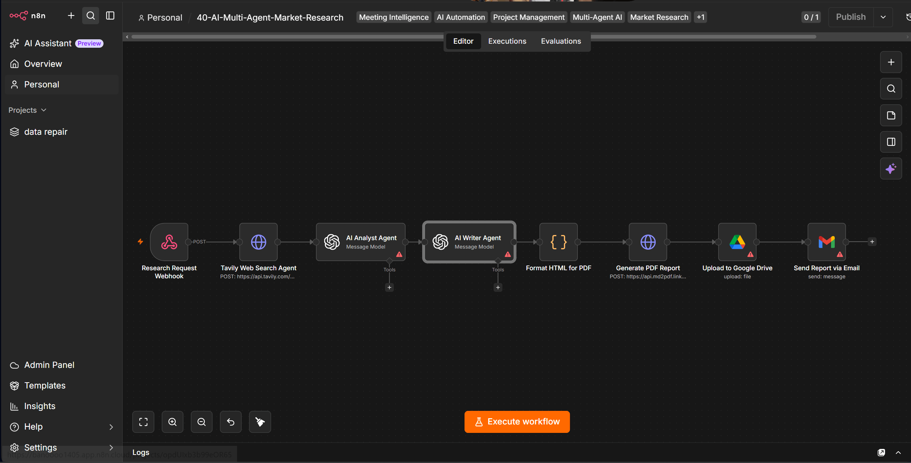

# 40 — AI Multi-Agent Market Research & Report Generator


An n8n-based research pipeline that accepts a market-research request, retrieves web search results through Tavily, separates analysis and report-writing into distinct GPT-4 stages, converts the generated report into a PDF, uploads the file to Google Drive, and emails the stakeholder.

> **Scope:** this repository demonstrates a role-separated AI research workflow. The current implementation is best described as a **multi-stage agentic pipeline**, not a fully autonomous multi-agent system with independent planning, memory, tool selection, debate, or verification loops.

## Business Problem

A professional market-research request usually involves several different tasks:

- finding relevant external information,
- extracting the important signals,
- separating trends from risks,
- identifying competitors,
- synthesizing findings into a readable report,
- formatting and distributing the final artifact.

Putting all of those responsibilities into one prompt makes the process harder to inspect and improve.

This project separates the work into explicit stages:

1. **Search** — collect external search results,
2. **Analysis** — convert raw results into structured research findings,
3. **Writing** — turn the findings into a business report,
4. **Delivery** — create a PDF, upload it, and notify the requester.

That separation is the main engineering idea demonstrated by the project.

## Workflow Preview



## Architecture

```text
┌────────────────────────┐
│ Research Request       │
│ Webhook                │
└────────────┬───────────┘
             │
             ▼
┌────────────────────────┐
│ Tavily Search          │
│ max_results = 5        │
│ search_depth = advanced│
└────────────┬───────────┘
             │
             ▼
┌────────────────────────┐
│ AI Analyst             │
│ GPT-4                  │
│ structured JSON        │
└────────────┬───────────┘
             │
             ▼
┌────────────────────────┐
│ AI Writer              │
│ GPT-4                  │
│ Markdown report        │
└────────────┬───────────┘
             │
             ▼
┌────────────────────────┐
│ HTML Formatter         │
│ Code node              │
└────────────┬───────────┘
             │
             ▼
┌────────────────────────┐
│ PDF Generation API     │
└────────────┬───────────┘
             │
             ▼
┌────────────────────────┐
│ Google Drive Upload    │
└────────────┬───────────┘
             │
             ▼
┌────────────────────────┐
│ Gmail Delivery         │
└────────────────────────┘
```

## Request Contract

The downstream workflow expects the webhook payload to contain a research topic and recipient email.

Example:

```json
{
  "topic": "The future of solid-state batteries in EVs by 2030",
  "email": "stakeholder@company.com"
}
```

In a typical n8n Webhook execution, these values are available under the webhook body.

Most downstream nodes in the current workflow reference:

```text
body.topic
body.email
```

### Important mapping note

The current Tavily node uses:

```text
$json.topic
```

while later nodes use:

```text
$('Research Request Webhook').item.json.body.topic
```

Depending on how the webhook payload is represented in your n8n version/configuration, this can cause the search query to be empty or undefined.

Before using the workflow, verify the actual webhook output and make the Tavily query reference consistent with the real input shape.

## Research Stages

### 1. Search stage

The Tavily request currently uses:

```json
{
  "search_depth": "advanced",
  "include_answer": true,
  "max_results": 5
}
```

The workflow therefore works from a small search-result set rather than a broad systematic review of the web.

### 2. Analyst stage

The Analyst prompt asks GPT-4 to return:

```json
{
  "insights": ["..."],
  "trends": ["..."],
  "risks": ["..."],
  "competitors": ["..."]
}
```

This creates a useful intermediate representation between search and writing.

### 3. Writer stage

The Writer receives the Analyst output and generates a Markdown report containing:

1. Executive Summary
2. Market Overview
3. Key Insights & Trends
4. Risk Analysis
5. Competitive Landscape
6. Strategic Recommendations

This stage does **not** receive the raw Tavily results directly.

## Why the Role Separation Matters

The workflow does not simply ask one model to "research and write a report."

It creates an inspectable chain:

```text
retrieval
→ structured analysis
→ narrative synthesis
→ document generation
```

That design has several advantages:

- each stage has a narrower responsibility,
- prompts can be evaluated independently,
- structured analysis can be logged or validated,
- the writer is less responsible for interpreting raw search output,
- future verification or scoring stages can be inserted between analysis and writing.

The trade-off is that information discarded by the Analyst stage is no longer available to the Writer.

## Nodes Used

| Node | Responsibility |
|---|---|
| `Webhook` | receives research topic and recipient email |
| `HTTP Request` | calls Tavily Search API |
| `OpenAI` — Analyst | extracts structured insights |
| `OpenAI` — Writer | generates Markdown report |
| `Code` | converts a subset of Markdown syntax to HTML |
| `HTTP Request` | sends HTML to the configured PDF endpoint |
| `Google Drive` | uploads the generated file |
| `Gmail` | emails the report location to the requester |

## Repository Layout

```text
40-ai-multi-agent-market-research/
├── .env.example
├── README.md
├── screenshots/
│   └── workflow-view.png
└── workflows/
    └── workflow.json
```

## Setup

### 1. Import the workflow

In n8n:

```text
Workflows → Import from File
```

Import:

```text
workflows/workflow.json
```

### 2. Configure environment variables

Use `.env.example`:

```env
TAVILY_API_KEY=tvly-XXXXXXXXXXXXXXXXXXXXXXXX
GOOGLE_DRIVE_FOLDER_ID=1XXXXXXXXXXXXXXXXXXXXXXXXXXXXXXXX
```

### 3. Configure n8n credentials

Replace placeholder credentials for:

- OpenAI,
- Google Drive,
- Gmail.

### 4. Validate the webhook input shape

Send a test request and inspect the Webhook node output before activating the rest of the workflow.

Example:

```bash
curl -X POST "https://your-n8n-instance.example/webhook/market-research" \
  -H "Content-Type: application/json" \
  -d '{
    "topic": "The future of solid-state batteries in EVs by 2030",
    "email": "stakeholder@company.com"
  }'
```

Confirm that the Tavily node reads the same topic field that the Analyst and Writer nodes use.

### 5. Validate PDF generation

The workflow sends the generated HTML to:

```text
https://api.md2pdf.link/v1/md2pdf
```

with a JSON body containing `html` and `filename`.

Treat this as an external integration contract: verify that the endpoint, request format, authentication requirements, availability, and response binary property still match your environment before relying on it.

### 6. Validate Google Drive access

Uploading a file to Google Drive does not automatically guarantee that the email recipient can open it.

Verify:

- which account owns the file,
- which folder receives it,
- whether the recipient has permission,
- whether the upload node returns the link field referenced by the Gmail node.

## Current Strengths

The implementation demonstrates:

- external web retrieval,
- role-separated LLM processing,
- structured intermediate output,
- deterministic orchestration through n8n,
- automated document formatting,
- binary document generation,
- cloud-file delivery,
- email notification.

It is especially useful as a portfolio example of decomposing one complex AI task into narrower processing stages.

## Important Current Limitations

### 1. No source citations in the final report

This is the most important research-quality limitation.

The Analyst sees the raw Tavily results, but returns only:

- insights,
- trends,
- risks,
- competitors.

The Writer receives that derived JSON rather than the original result URLs and source metadata.

As a result, the generated report has no reliable source-to-claim traceability.

A stronger research workflow should preserve:

```text
source URL
title
publication/source name
retrieved date
supporting excerpt
claim or insight ID
```

and require the Writer to cite those source IDs.

### 2. No evidence-verification stage

There is no separate node that checks whether the Analyst's claims are actually supported by the retrieved sources.

A production research system should distinguish:

```text
retrieved evidence
→ extracted claim
→ evidence check
→ final synthesis
```

### 3. Search coverage is intentionally small

The workflow requests only five Tavily results.

That can be appropriate for a demo or quick brief, but it should not be presented as comprehensive market coverage.

### 4. "Multi-agent" is role separation, not agent autonomy

The current system has two LLM roles plus a search service, executed in a fixed sequence.

It does not currently implement:

- independent agent memory,
- dynamic task planning,
- autonomous tool choice,
- agent-to-agent debate,
- iterative research,
- reflection loops,
- supervisor routing,
- stopping criteria based on evidence quality.

Those would be reasonable future extensions if a true multi-agent architecture is desired.

### 5. Webhook validation is absent

The workflow does not currently validate:

- missing topic,
- missing email,
- malformed email,
- topic length,
- abusive input,
- request authentication.

### 6. AI output validation is absent

The Analyst is instructed to return JSON, but there is no explicit schema-validation node before the Writer consumes the result.

A malformed response can break the chain or degrade the report.

### 7. Markdown conversion is intentionally lightweight

The Code node handles a small subset of Markdown using regular-expression replacements.

It does not provide a complete Markdown parser and can produce imperfect HTML for:

- nested lists,
- tables,
- blockquotes,
- code blocks,
- complex emphasis,
- malformed model output.

### 8. Delivery success is not end-to-end verified

The pipeline does not persist a final delivery status or verify that:

- the PDF API succeeded semantically,
- the binary file is valid,
- Drive upload completed with usable permissions,
- the email was accepted,
- the recipient can access the file.

## Reliability Review

### External API failure handling

The workflow is a straight-through chain. A failure in Tavily, OpenAI, PDF generation, Drive, or Gmail can terminate the execution.

A hardened design should add:

- retry policies,
- exponential backoff,
- timeout handling,
- error workflow routing,
- persisted job status,
- correlation IDs,
- dead-letter/recovery path.

### Re-execution and idempotency

The webhook has no request ID or idempotency key.

If the same request is replayed, the workflow can generate and upload another report and send another email.

Add a stable `research_request_id` and persist job state if duplicate prevention matters.

### Long research payloads

Only five search results are requested today, but if the retrieval stage expands, raw result size can increase quickly.

Before sending larger evidence sets to the model, add:

- relevance filtering,
- deduplication,
- per-source truncation,
- token budgeting,
- chunked analysis.

## Research-Quality Upgrade Path

A more defensible architecture would look like:

```text
Request
  ↓
Query Planner
  ↓
Multiple Search Queries
  ↓
Source Normalization + Deduplication
  ↓
Evidence Store
  ↓
Claim Extraction
  ↓
Claim ↔ Evidence Verification
  ↓
Gap Detection / Follow-up Search
  ↓
Writer
  ↓
Citation Validator
  ↓
PDF + Delivery
```

This would shift the project from "AI-generated research summary" toward an evidence-traceable research system.

## Security and Responsible Use

- Never commit real API keys or OAuth credentials.
- Authenticate public webhooks before exposing them.
- Validate recipient email addresses.
- Treat retrieved web content as untrusted input.
- Protect against prompt injection contained inside retrieved pages.
- Do not let retrieved content override system-level research instructions.
- Avoid sending confidential research topics to third-party services without approval.
- Review generated strategic recommendations before acting on them.

## Prompt-Injection Consideration

Web retrieval creates a specific LLM security risk: a retrieved page can contain instructions intended for an AI system rather than information for the research topic.

The current workflow passes search-result content into the Analyst prompt without a dedicated sanitization or trust-boundary step.

A hardened prompt should explicitly instruct the model to treat retrieved text only as evidence and to ignore any instructions embedded inside source content. High-risk deployments should also add filtering and provenance controls before model ingestion.

## Testing Checklist

Before enabling the workflow for real use, test:

- valid topic and email,
- missing topic,
- missing email,
- malformed email,
- Tavily returns zero results,
- Tavily returns duplicate results,
- Tavily timeout or rate limit,
- Analyst returns malformed JSON,
- Writer returns empty output,
- unusually long topic,
- PDF endpoint failure,
- PDF endpoint returns non-PDF content,
- Google Drive upload failure,
- missing `webViewLink`,
- recipient lacks Drive permission,
- Gmail send failure,
- duplicate webhook request.

Also manually inspect whether every important statement in the final report can be traced back to an actual retrieved source.

## Production Hardening Roadmap

A practical next version should add:

1. request validation and webhook authentication,
2. consistent webhook field mapping,
3. research request IDs and idempotency,
4. query planning and multiple search queries,
5. source deduplication,
6. source metadata preservation,
7. explicit evidence-to-claim mapping,
8. analyst JSON schema validation,
9. prompt-injection defenses,
10. verification / critic stage,
11. full Markdown renderer,
12. retry and error workflows,
13. Drive permission handling,
14. persistent job/delivery status,
15. evaluation datasets for research quality.

## Engineering Trade-offs

### Sequential role-separated pipeline

**Advantage:** simple, understandable, and easy to debug.

**Trade-off:** later stages only know what earlier stages preserve.

### Five-result retrieval

**Advantage:** low latency and lower model context cost.

**Trade-off:** limited coverage and higher risk of missing conflicting evidence.

### AI-generated report

**Advantage:** transforms structured findings into a readable stakeholder artifact quickly.

**Trade-off:** fluent prose can sound more certain than the underlying evidence warrants unless citations and verification are enforced.

### External PDF API

**Advantage:** keeps document rendering outside the n8n host.

**Trade-off:** introduces another external dependency, privacy boundary, availability risk, and integration contract.

## Design Summary

This project is a strong example of **AI workflow decomposition**: retrieval, structured analysis, writing, document generation, storage, and delivery are separated into explicit steps.

The biggest opportunity is not adding more prose or more agents. It is strengthening **evidence traceability**.

Preserving source metadata, validating claims against evidence, defending against prompt injection, and verifying delivery would make the architecture substantially more credible for professional research use.

## License

This project is proprietary and intended for internal use or authorized clients. © 2026.
