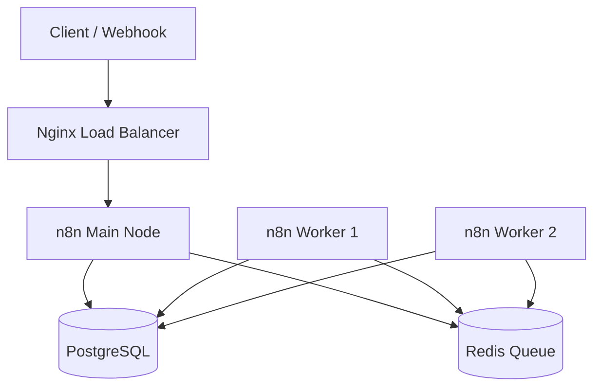

# n8n High-Availability Cluster (Self-Hosting)

> Project 41 of the n8n Enterprise practice series
> High-Availability cluster using Docker Compose, Nginx Load Balancer, PostgreSQL, and Redis Queue Mode

---

## Table of Contents
- [Architecture](#architecture)
- [Prerequisites](#prerequisites)
- [Project Structure](#project-structure)
- [Quick Start](#quick-start)
- [Import Monitoring Workflow](#import-monitoring-workflow)
- [Scaling](#scaling)
- [Troubleshooting](#troubleshooting)
- [Security Notes](#security-notes)

---

## Architecture



### Cluster Components

| Service | Role | Port |
|---|---|---|
| n8n_main | UI, Webhook handling, Orchestrator | 5678 |
| n8n_worker | Processes jobs from Redis queue (scalable) | - |
| postgres | Stores workflows, credentials, execution history | 5432 |
| redis | Job queue (Queue Mode) and cache | 6379 |
| nginx | Reverse proxy, load balancing, SSL termination | 80/443 |

---

## Prerequisites

- Docker Engine 24.0+
- Docker Compose 2.20+
- RAM: minimum 4GB (8GB recommended for production)
- CPU: minimum 2 cores
- OS: Linux, macOS, or Windows with WSL2

---

## Project Structure

```text
41-n8n-ha-cluster/
├── docker-compose.yml              # Container orchestration
├── nginx/
│   └── nginx.conf                  # Load balancer and reverse proxy config
├── workflows/
│   └── ha-cluster-health-monitor.json   # Monitoring workflow (import into n8n)
├── data/                           # Persistent data (git-ignored)
│   ├── postgres/
│   └── redis/
├── .env                            # Environment variables (git-ignored)
├── .env.example                    # Environment variable template
├── .gitignore                      # Git exclusion rules
└── README.md                       # This file
```

---

## Quick Start

### 1. Configure environment variables
```bash
cd 41-n8n-ha-cluster
cp .env.example .env
# Open .env and replace all CHANGE_ME values
```

### 2. Generate a secure encryption key
```bash
openssl rand -hex 16
# Put the output into N8N_ENCRYPTION_KEY
```

### 3. Start the cluster
```bash
docker compose up -d
```

### 4. Verify service status
```bash
docker compose ps
```
You should see 5 services (postgres, redis, n8n_main, n8n_worker, nginx) with status Up (healthy).

### 5. Access the n8n panel
```text
http://localhost:5678
```

---

## Import Monitoring Workflow

The file `workflows/ha-cluster-health-monitor.json` is an Enterprise workflow for monitoring cluster health.

### Import steps
1. Log in to the n8n panel.
2. From the top menu: Workflows -> Import from File.
3. Select `ha-cluster-health-monitor.json`.
4. Activate the workflow.

### Workflow features
- Scheduled run every 5 minutes
- Loops over 4 cluster services (SplitInBatch)
- Conditional routing based on health status (IF)
- Different alerts for Critical vs Warning services
- Final report using Merge and Code nodes

---

## Scaling

Increase worker count without downtime:
```bash
docker compose up -d --scale n8n_worker=5
```

Check active workers:
```bash
docker compose ps | grep worker
```

---

## Troubleshooting

| Issue | Diagnostic command |
|---|---|
| n8n won't start | docker compose logs -f n8n_main |
| Worker not connecting | docker compose exec redis redis-cli ping |
| Database error | docker compose exec postgres pg_isready -U n8n |
| Nginx returns 502 | docker compose logs -f nginx |
| Overall health check | docker compose ps |

Restart the cluster without deleting data:
```bash
docker compose restart
```

Full reset (WARNING: deletes data):
```bash
docker compose down -v
```

---

## Security Notes

- Never commit the `.env` file to Git (already in `.gitignore`).
- Always enable SSL in Nginx for production.
- Generate `N8N_ENCRYPTION_KEY` using `openssl rand -hex 16`.
- After deployment, replace Basic Auth with stronger authentication (OAuth/OIDC).
- Close ports 5432 and 6379 in your firewall; keep them accessible only from the internal Docker network.

---

## Notes

- This project is designed for practicing Enterprise architecture concepts.
- For real production use, always use a valid SSL reverse proxy and regular backups.

---

Repository: https://github.com/kooroosh1363/n8n-workflows-practice
Author: kooroosh1363
Date: 2026