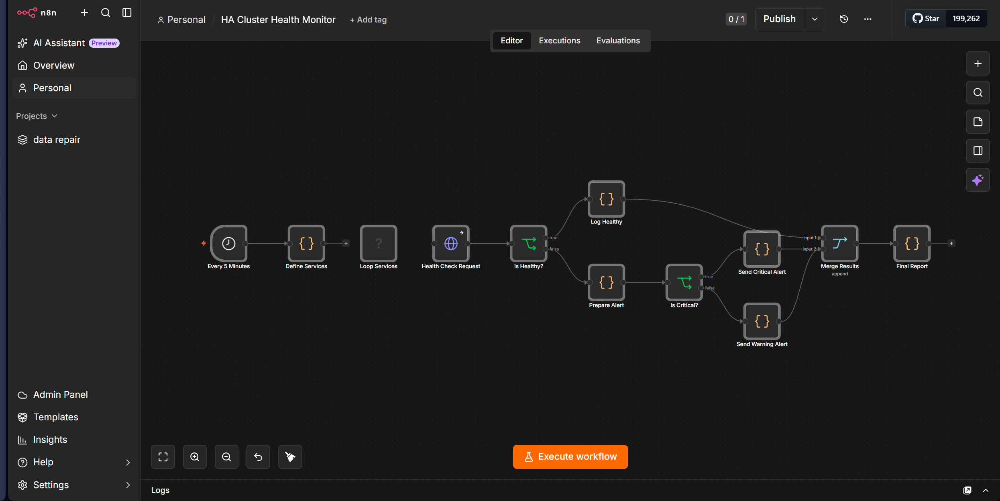

# 41 — n8n Queue-Mode Cluster with PostgreSQL, Redis & Nginx


A self-hosted n8n reference architecture that demonstrates queue-mode execution with PostgreSQL, Redis, horizontally scalable workers, and Nginx in front of the n8n main process.

> **Important:** this repository demonstrates **queue-mode scaling and component separation**, but the current Docker Compose topology is **not a fully high-availability deployment**. PostgreSQL, Redis, Nginx, and the n8n main process are each single instances in the exported configuration and therefore remain single points of failure.

## Business Problem

A single-process automation server eventually runs into operational limits:

- long-running workflows can compete with UI and webhook traffic,
- one execution process limits horizontal scaling,
- worker failure can interrupt active capacity,
- application state must survive container restarts,
- incoming traffic needs a stable entry point,
- operators need a clear path from a single-node setup toward a distributed architecture.

n8n queue mode addresses part of this problem by separating orchestration from workflow execution:

```text
incoming request / scheduler
        ↓
     n8n main
        ↓
   Redis job queue
        ↓
 one or more workers
        ↓
    PostgreSQL state
```

This project demonstrates that scaling model on a single Docker host.

## Architecture

```text
                   ┌───────────────────────┐
                   │ Client / Webhook      │
                   └───────────┬───────────┘
                               │
                               ▼
                   ┌───────────────────────┐
                   │ Nginx                 │
                   │ reverse proxy         │
                   └───────────┬───────────┘
                               │
                               ▼
                   ┌───────────────────────┐
                   │ n8n Main              │
                   │ UI / orchestration    │
                   │ queue producer        │
                   └───────┬────────┬──────┘
                           │        │
                    state  │        │ jobs
                           ▼        ▼
                 ┌────────────┐  ┌────────────┐
                 │ PostgreSQL │  │ Redis      │
                 └──────┬─────┘  └─────┬──────┘
                        │              │
                        │              ▼
                        │      ┌─────────────────┐
                        └─────►│ n8n Worker(s)   │
                               │ queue consumers │
                               └─────────────────┘
```

## What the Current Compose File Actually Provides

| Component | Current role | Current topology |
|---|---|---|
| `n8n_main` | UI, webhook handling, scheduling, queue producer | 1 container |
| `n8n_worker` | queue consumer / workflow execution | scalable |
| `postgres` | workflow, credential and execution state | 1 container |
| `redis` | queue backend | 1 container |
| `nginx` | reverse proxy | 1 container |

The main and worker processes share the same PostgreSQL database, Redis queue, encryption key, and local n8n data volume.

## Why Queue Mode Matters

Queue mode improves execution scalability by allowing additional workers to consume jobs from Redis without turning the main n8n process into the execution bottleneck.

This helps with:

- increasing execution concurrency,
- isolating execution work from UI/orchestration work,
- replacing failed workers,
- scaling worker capacity independently.

It does **not**, by itself, make the platform highly available.

A truly HA design also needs redundancy for the control plane and stateful dependencies.

## Repository Layout

```text
41-n8n-ha-cluster/
├── .env.example
├── .gitignore
├── docker-compose.yml
├── nginx/
│   └── nginx.conf
├── screenshot/
│   └── ha-cluster-health-monitor.png
├── workflows/
│   └── ha-cluster-health-monitor.json
└── README.md
```

## Quick Start

### 1. Create the environment file

```bash
cd 41-n8n-ha-cluster
cp .env.example .env
```

Replace every `CHANGE_ME` value before starting the stack.

Example variables:

```env
POSTGRES_USER=n8n
POSTGRES_PASSWORD=CHANGE_ME_SECURE_PASSWORD
POSTGRES_DB=n8n

N8N_ENCRYPTION_KEY=CHANGE_ME_32_CHAR_RANDOM_KEY
N8N_HOST=localhost
WEBHOOK_URL=http://localhost/
GENERIC_TIMEZONE=Asia/Tehran

N8N_BASIC_AUTH_USER=admin
N8N_BASIC_AUTH_PASSWORD=CHANGE_ME_ADMIN_PASSWORD
```

### 2. Generate a strong encryption key

For example:

```bash
openssl rand -hex 32
```

Use the same `N8N_ENCRYPTION_KEY` for the main process and every worker. Changing it after credentials are stored can make existing encrypted credentials unreadable.

### 3. Start the stack

```bash
docker compose up -d
```

### 4. Inspect running services

```bash
docker compose ps
```

### 5. Inspect logs

```bash
docker compose logs -f n8n_main
docker compose logs -f n8n_worker
docker compose logs -f postgres
docker compose logs -f redis
docker compose logs -f nginx
```

## Scaling Workers

Scale the execution tier independently:

```bash
docker compose up -d --scale n8n_worker=5
```

Then verify:

```bash
docker compose ps
```

This is the strongest scaling feature in the current project: worker capacity can be increased without changing the application workflow definitions.

### Scaling limitation

All workers still run on the same Docker host and depend on the same Redis and PostgreSQL instances.

Therefore:

```text
more workers ≠ multi-host high availability
```

A host failure still takes down the entire stack.

## Nginx Behavior

The current Nginx configuration defines one upstream:

```nginx
upstream n8n_backend {
    server n8n_main:5678;
}
```

That means Nginx is currently acting as a **reverse proxy to one main node**, not as an active load balancer across multiple n8n main processes.

The configuration also forwards:

- normal UI traffic,
- WebSocket upgrade headers,
- `/webhook/` traffic,
- original host and forwarding headers.

### Port 443 reality check

Docker publishes:

```text
80:80
443:443
```

but the current Nginx configuration only contains:

```nginx
listen 80;
```

There is no TLS listener, certificate, or private-key configuration in the repository.

So the current stack is **HTTP-only** until TLS is explicitly configured.

Do not describe port 443 as active SSL termination in the current version.

## Direct Port Exposure

The Compose file also publishes:

```text
5678:5678
```

for `n8n_main`.

This means users can access n8n directly and bypass Nginx.

That is convenient for local development, but a production deployment should normally choose one controlled ingress path and avoid exposing the application port publicly unless there is a specific operational reason.

## PostgreSQL

PostgreSQL is the durable application database for n8n state.

The project uses a bind-mounted data directory:

```text
./data/postgres:/var/lib/postgresql/data
```

and includes a `pg_isready` health check.

### Current availability boundary

The repository has one PostgreSQL container.

If it fails or the underlying host/storage fails, n8n loses access to its primary state store.

Production HA options typically require an external managed PostgreSQL service or a properly operated replicated PostgreSQL topology.

## Redis

Redis is configured with:

```text
--appendonly yes
```

and persists data under:

```text
./data/redis:/data
```

It also has a `redis-cli ping` health check.

### Current availability boundary

The current project has one Redis instance.

Queue-mode workers therefore share a single queue dependency. Redis failure can stop job dispatch/consumption even when the workers themselves are healthy.

A production HA design needs an appropriate Redis high-availability strategy rather than only worker scaling.

## n8n Data Volume

Both the main process and workers mount:

```text
n8n_data:/home/node/.n8n
```

In this single-host Compose design, the named Docker volume is local to that host.

That is workable for this reference topology, but it is not a portable shared-filesystem solution for a multi-host deployment.

If workflows depend on filesystem-based binary data or local files, storage semantics need to be reviewed before distributing workers across hosts.

## Health Monitoring Workflow

The repository includes:

```text
workflows/ha-cluster-health-monitor.json
```

and a corresponding screenshot:



The workflow is useful as an **illustrative monitoring design**, but its current health checks should not be treated as production-valid service probes.

### Why

It attempts HTTP requests to endpoints such as:

```text
http://localhost:5432/health
http://localhost:6379/health
```

PostgreSQL and Redis do not expose HTTP health endpoints on their native ports.

Inside the n8n container, `localhost` also refers to that container itself, not to sibling Compose services.

A real monitor should use service-aware checks such as:

- PostgreSQL: `pg_isready` or a SQL query,
- Redis: `PING`,
- n8n: documented HTTP health/metrics endpoints,
- Nginx: a deliberately configured health endpoint,
- workers: queue/worker metrics rather than an assumed HTTP port.

### Alerting reality check

The current “critical” and “warning” alert nodes are Code nodes that simulate channels such as SMS and Slack.

They do not currently integrate with PagerDuty, SMS, email, or Slack APIs.

The monitor should therefore be presented as a workflow prototype, not as implemented production monitoring.

## Availability Model

The current project improves **execution redundancy** at the worker layer, but the dependency graph still contains multiple single points of failure:

```text
Nginx        → single instance
n8n main     → single instance
PostgreSQL   → single instance
Redis        → single instance
Docker host  → single host
```

Worker scaling protects against:

- one worker process failing,
- insufficient worker capacity.

It does not protect against:

- host failure,
- main-process failure,
- database failure,
- queue failure,
- ingress failure,
- storage failure.

That distinction is important when discussing this project in an interview or architecture review.

## Failure Scenarios

| Failure | Current effect | Production direction |
|---|---|---|
| One worker dies | remaining workers may continue | restart policy + capacity monitoring |
| n8n main dies | UI/webhook/orchestration unavailable | multiple supported main/webhook processes + HA ingress |
| Redis dies | queue processing stops | managed/HA Redis architecture |
| PostgreSQL dies | n8n state unavailable | HA/managed PostgreSQL |
| Nginx dies | ingress unavailable | redundant LB / managed ingress |
| Docker host dies | entire stack unavailable | multi-host orchestration |
| local volume lost | persistent state at risk | backups + durable external storage |

## Security Notes

- Never commit `.env`.
- Use long, unique secrets for PostgreSQL, Basic Auth, and n8n encryption.
- Do not expose PostgreSQL or Redis ports publicly.
- Put TLS in front of n8n before internet exposure.
- Restrict direct access to port 5678 if Nginx is the intended ingress.
- Pin container versions rather than relying on `:latest` for controlled deployments.
- Run regular PostgreSQL backups and restoration tests.
- Review execution-data retention because workflow payloads can contain sensitive information.
- Protect metrics endpoints if they are exposed.
- Use firewall/network controls in addition to Docker networking.

## Version Pinning

The current Compose file uses:

```text
n8nio/n8n:latest
```

for both main and workers.

That is convenient for a lab, but production deployments should pin a tested n8n version so an image pull cannot silently introduce an unreviewed application upgrade.

The same principle applies to PostgreSQL, Redis, and Nginx images when controlled reproducibility matters.

## Operational Checks

Useful checks include:

```bash
docker compose ps
docker compose logs --tail=100 n8n_main
docker compose logs --tail=100 n8n_worker
docker compose exec postgres pg_isready -U "$POSTGRES_USER" -d "$POSTGRES_DB"
docker compose exec redis redis-cli ping
```

For queue-mode validation, create a controlled workflow that produces enough executions to observe jobs being consumed by multiple workers.

Do not infer worker redundancy only from the number of running containers.

## Production Hardening Roadmap

A stronger production architecture would add:

1. pinned image versions,
2. real TLS configuration,
3. one controlled ingress path,
4. multiple supported n8n control/webhook processes where appropriate,
5. HA or managed PostgreSQL,
6. HA or managed Redis,
7. multi-host orchestration,
8. durable/shared storage strategy where required,
9. real service-aware monitoring,
10. Prometheus/Grafana or equivalent observability,
11. alert delivery to real incident-management channels,
12. PostgreSQL backup and restore automation,
13. Redis persistence/recovery testing,
14. capacity/load testing,
15. documented RTO/RPO,
16. rolling upgrade and rollback procedures.

## Engineering Trade-offs

### Queue mode

**Advantage:** execution workers scale independently.

**Trade-off:** introduces Redis and more distributed-system failure modes.

### Docker Compose

**Advantage:** easy to understand, reproduce, and operate on one host.

**Trade-off:** it is not a multi-host HA orchestrator.

### Nginx reverse proxy

**Advantage:** central ingress and forwarding layer.

**Trade-off:** one Nginx container becomes another single point of failure.

### Local stateful services

**Advantage:** self-contained and low-cost for a lab.

**Trade-off:** database, queue, and storage availability are tied to one host.

## Interview Defense

A concise description of the project:

> This project demonstrates n8n queue-mode scaling rather than claiming full HA. The main process publishes executions to Redis, workers consume jobs independently, and PostgreSQL stores durable n8n state. Nginx provides a single ingress point. The worker tier can scale horizontally, but the current Compose topology still has single-instance PostgreSQL, Redis, Nginx, and main-node dependencies, so true HA would require redundant stateful services, multi-host orchestration, real TLS, and service-aware monitoring.

That explanation is more technically defensible than calling the current five-container Compose stack “fully highly available.”

## License

This project is proprietary and intended for internal use or authorized clients. © 2026.
