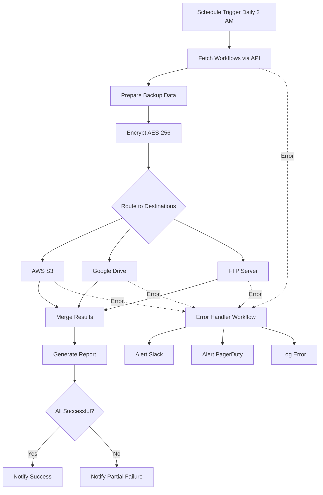

# n8n Automated Backup & Disaster Recovery System


> Project 42 of the n8n Enterprise practice series
> Multi-destination encrypted backup pipeline with intelligent error handling and disaster recovery

---

## Table of Contents
- [Architecture](#architecture)
- [Features](#features)
- [Prerequisites](#prerequisites)
- [Project Structure](#project-structure)
- [Installation & Configuration](#installation--configuration)
- [Workflow Descriptions](#workflow-descriptions)
- [Backup Destinations](#backup-destinations)
- [Error Handling & Recovery](#error-handling--recovery)
- [Testing the Pipeline](#testing-the-pipeline)
- [Troubleshooting](#troubleshooting)
- [Security Notes](#security-notes)

---

## Architecture



---

## Features

- Scheduled daily encrypted backups (configurable cron expression)
- Multi-destination uploads (AWS S3, Google Drive, FTP)
- AES-256 encryption for all backup files
- Conditional routing based on enabled destinations
- Comprehensive error handling with dedicated Error Workflow
- Real-time notifications via Slack and PagerDuty
- Execution reports with success/failure metrics
- Automatic checksum generation for data integrity verification

---

## Prerequisites

- n8n instance with API access enabled
- AWS Account with S3 bucket (for S3 destination)
- Google Cloud project with Drive API (for Google Drive destination)
- FTP server credentials (for FTP destination)
- Slack workspace with incoming webhook
- PagerDuty account (optional, for critical alerts)

---

## Project Structure

```text
42-n8n-backup-system/
├── workflows/
│   ├── n8n-backup-pipeline.json           # Main backup workflow
│   └── disaster-recovery-error-handler.json  # Error handling workflow
├── README.md                              # This file
├── .gitignore                             # Git exclusion rules
└── .env.example                           # Environment variable template
```

---

## Installation & Configuration

### 1. Import Workflows

1. Log in to your n8n instance.
2. Navigate to **Workflows** → **Import from File**.
3. Import `workflows/n8n-backup-pipeline.json`.
4. Import `workflows/disaster-recovery-error-handler.json`.

### 2. Configure Credentials

In n8n, create the following credentials:

| Credential Type | Purpose |
|---|---|
| Header Auth | n8n API Key authentication |
| AWS | S3 bucket access |
| Google Drive OAuth2 API | Google Drive uploads |
| FTP | FTP server access |

### 3. Set Environment Variables

Copy `.env.example` to `.env` and configure:

```bash
cp .env.example .env
```

Required variables:

```env
N8N_API_URL=http://localhost:5678
N8N_API_KEY=your_n8n_api_key
BACKUP_ENCRYPTION_KEY=your_32_char_encryption_key
BACKUP_DESTINATIONS=s3,gdrive,ftp
AWS_S3_BUCKET=your-backup-bucket
SLACK_WEBHOOK_URL=https://hooks.slack.com/services/...
PAGERDUTY_WEBHOOK_URL=https://events.pagerduty.com/v2/enqueue
```

### 4. Link Error Workflow

1. Open the **Disaster Recovery Error Handler** workflow.
2. Copy its Workflow ID from the URL.
3. Open the **n8n Backup Pipeline** workflow.
4. Go to **Settings** → **Error Workflow**.
5. Paste the Error Handler workflow ID.
6. Save and activate both workflows.

---

## Workflow Descriptions

### 1. n8n Backup Pipeline

| Node | Type | Purpose |
|---|---|---|
| Daily 2 AM | Schedule Trigger | Starts backup at 2:00 AM daily |
| Fetch All Workflows | HTTP Request | Retrieves all workflows via n8n API |
| Prepare Backup Data | Code | Formats data with metadata and checksum |
| Encrypt Backup | Crypto | Encrypts data with AES-256-CBC |
| S3 Enabled? / GDrive Enabled? / FTP Enabled? | IF | Checks which destinations are active |
| Upload to S3 | AWS S3 | Uploads encrypted file to S3 |
| Upload to Google Drive | Google Drive | Uploads encrypted file to Drive |
| Upload to FTP | FTP | Uploads encrypted file to FTP server |
| Merge Upload Results | Merge | Combines results from all destinations |
| Generate Report | Code | Creates summary with success/failure counts |
| All Successful? | IF | Routes to appropriate notification |
| Notify Success / Notify Partial Failure | HTTP Request | Sends status to Slack |

### 2. Disaster Recovery Error Handler

| Node | Type | Purpose |
|---|---|---|
| Error Trigger | Error Trigger | Captures errors from main workflow |
| Format Error Data | Code | Extracts error details and severity |
| Is Critical? | IF | Determines alert level |
| Alert Slack | HTTP Request | Sends critical alert to Slack |
| Alert PagerDuty | HTTP Request | Triggers PagerDuty incident |
| Alert Slack Warning | HTTP Request | Sends warning for non-critical errors |
| Log Error | Code | Logs error for audit trail |
| Verify Logged? | IF | Confirms logging success |
| Final Summary / Escalate | Code | Provides resolution or escalation path |

---

## Backup Destinations

Configure destinations via the `BACKUP_DESTINATIONS` environment variable:

```env
# Enable all destinations
BACKUP_DESTINATIONS=s3,gdrive,ftp

# Enable only S3 and Google Drive
BACKUP_DESTINATIONS=s3,gdrive

# Enable only FTP
BACKUP_DESTINATIONS=ftp
```

The workflow automatically skips disabled destinations.

---

## Error Handling & Recovery

### Error Flow

1. Any node failure in the backup pipeline triggers the Error Handler workflow.
2. The Error Handler formats error data with severity assessment.
3. Critical errors trigger both Slack and PagerDuty alerts.
4. Non-critical errors send Slack warnings only.
5. All errors are logged for audit and debugging.
6. If logging fails, the system escalates for manual intervention.

### Recovery Scenarios

| Scenario | Automated Response | Manual Action Required |
|---|---|---|
| Single destination failure | Continue with other destinations, report partial success | Check failed destination credentials |
| All destinations failure | Trigger Error Handler, send critical alerts | Verify network and storage services |
| n8n API unreachable | Trigger Error Handler immediately | Check n8n instance health |
| Encryption failure | Abort backup, trigger Error Handler | Verify encryption key configuration |

---

## Testing the Pipeline

### Manual Test

1. Open the **n8n Backup Pipeline** workflow.
2. Click **Execute Workflow**.
3. Monitor each node execution.
4. Verify backup files appear in configured destinations.

### Verify Encryption

```bash
# Backup files should have .enc extension and be unreadable without the key
file backup_2026-08-05T02-00-00.enc
# Output: data (binary, encrypted)
```

### Test Error Handling

1. Temporarily disable one destination (e.g., set `BACKUP_DESTINATIONS=s3,gdrive` but remove FTP credentials).
2. Execute the workflow.
3. Verify that:
   - Enabled destinations succeed
   - Failed destination triggers error handling
   - Slack receives partial failure notification

---

## Troubleshooting

| Issue | Solution |
|---|---|
| API returns 401 | Verify `N8N_API_KEY` is correct and API is enabled |
| S3 upload fails | Check AWS credentials and bucket permissions |
| Google Drive auth expired | Re-authenticate OAuth2 credentials in n8n |
| FTP connection timeout | Verify FTP server is reachable and firewall allows connections |
| Encryption error | Ensure `BACKUP_ENCRYPTION_KEY` is exactly 32 characters |
| Error Handler not triggering | Confirm Error Workflow ID is set in backup pipeline settings |
| Slack notification not sent | Verify `SLACK_WEBHOOK_URL` is valid and webhook is active |

---

## Security Notes

- Never commit `.env` or credential files to version control.
- Use separate IAM users with minimal permissions for backup operations.
- Rotate encryption keys quarterly.
- Store backup encryption keys in a secrets manager (e.g., AWS Secrets Manager, HashiCorp Vault).
- Enable MFA on all cloud accounts used for backup destinations.
- Regularly test backup restoration to ensure data recoverability.
- Audit backup logs monthly for anomalies.

---

## Notes

- This project demonstrates Enterprise-oriented backup patterns for n8n.
- For production use, consider adding backup retention policies and automated cleanup.
- Schedule backups during low-traffic periods to minimize performance impact.
- Monitor backup file sizes over time to detect unexpected growth.

---

Repository: https://github.com/kooroosh1363/agentic-automation-lab
Author: kooroosh1363
Date: 2026
