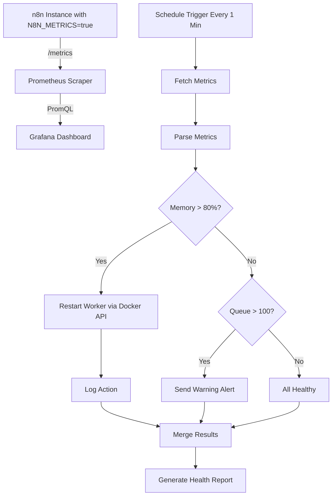

n8n Monitoring Dashboard & Smart Alerting

> Project 43 of the n8n Enterprise practice series
> Production-grade infrastructure monitoring with Prometheus, Grafana, and automated worker remediation

---

## Table of Contents
- [Architecture](#architecture)
- [Features](#features)
- [Prerequisites](#prerequisites)
- [Project Structure](#project-structure)
- [Installation & Configuration](#installation--configuration)
- [Monitoring Workflow](#monitoring-workflow)
- [Prometheus Configuration](#prometheus-configuration)
- [Grafana Dashboard](#grafana-dashboard)
- [Auto-Remediation](#auto-remediation)
- [Testing](#testing)
- [Troubleshooting](#troubleshooting)
- [Security Notes](#security-notes)

---

## Architecture



---

## Features

- Real-time metrics collection from n8n (`/metrics` endpoint)
- Prometheus scraping with 15s interval
- Grafana dashboard with stat and timeseries panels
- Automated worker restart when memory exceeds 80%
- Queue overload detection with warning alerts
- Multi-branch decision logic (IF / Merge)
- Health report generation with action tracking
- Slack notifications for warnings and remediation events

---

## Prerequisites

- n8n instance with `N8N_METRICS=true` enabled
- Docker Engine 24.0+ and Docker Compose 2.20+
- Docker API exposed on port 2375 (for auto-remediation)
- Slack workspace with incoming webhook
- RAM: minimum 4GB for the monitoring stack

---

## Project Structure

```text
43-n8n-monitoring-dashboard/
├── workflows/
│   └── n8n-infrastructure-monitor.json   # Monitoring & auto-remediation workflow
├── prometheus/
│   └── prometheus.yml                    # Prometheus scrape configuration
├── grafana/
│   └── dashboards/
│       └── n8n-overview.json             # Grafana dashboard definition
├── screenshots/                          # Project screenshots
├── docker-compose.yml                    # Prometheus + Grafana stack
├── README.md                             # This file
├── .gitignore                            # Git exclusion rules
└── .env.example                          # Environment variable template
```

---

## Installation & Configuration

### 1. Enable n8n Metrics

Add to your n8n environment:

```env
N8N_METRICS=true
```

Restart n8n. Verify metrics are exposed:

```bash
curl http://localhost:5678/metrics
```

### 2. Configure Environment Variables

```bash
cp .env.example .env
# Edit .env and set your values
```

### 3. Start the Monitoring Stack

```bash
docker compose up -d
```

Services:
- Prometheus: http://localhost:9090
- Grafana: http://localhost:3000

### 4. Add Prometheus Data Source in Grafana

1. Log in to Grafana (default admin/admin, then set your password).
2. Go to **Connections** → **Data sources** → **Add data source**.
3. Select **Prometheus**.
4. Set URL to `http://prometheus:9090`.
5. Click **Save & test**.

### 5. Import the Dashboard

1. Go to **Dashboards** → **Import**.
2. Upload `grafana/dashboards/n8n-overview.json`.
3. Select the Prometheus data source.
4. Click **Import**.

### 6. Import the Monitoring Workflow

1. In n8n, go to **Workflows** → **Import from File**.
2. Select `workflows/n8n-infrastructure-monitor.json`.
3. Activate the workflow.

---

## Monitoring Workflow

| Node | Type | Purpose |
|---|---|---|
| Every Minute | Schedule Trigger | Runs health check every 60 seconds |
| Fetch n8n Metrics | HTTP Request | Pulls raw Prometheus metrics from n8n |
| Parse Metrics | Code | Extracts memory, active workflows, queue size |
| Memory Critical? | IF | Checks if memory usage exceeds 80% |
| Restart Worker via Docker | HTTP Request | Auto-restarts worker container via Docker API |
| Log Action | Code | Records the remediation event |
| Queue Overloaded? | IF | Checks if queue size exceeds 100 |
| Send Warning Alert | HTTP Request | Posts warning to Slack |
| All Healthy | Code | Confirms system is healthy |
| Merge Results | Merge | Combines all branches |
| Generate Health Report | Code | Produces final status summary |

---

## Prometheus Configuration

The `prometheus/prometheus.yml` file scrapes:

| Job | Target | Purpose |
|---|---|---|
| n8n | n8n:5678/metrics | n8n application metrics |
| prometheus | localhost:9090 | Prometheus self-monitoring |

Key metrics used:
- `process_resident_memory_bytes` — memory usage
- `n8n_active_workflows` — active workflow count
- `bull_queue_waiting` — pending jobs in queue

---

## Grafana Dashboard

The `n8n-overview` dashboard includes:

| Panel | Type | Metric |
|---|---|---|
| Memory Usage (MB) | Stat | process_resident_memory_bytes |
| Active Workflows | Stat | n8n_active_workflows |
| Queue Size | Stat | bull_queue_waiting |
| Memory Over Time | Timeseries | process_resident_memory_bytes |
| Queue Size Over Time | Timeseries | bull_queue_waiting |

---

## Auto-Remediation

The workflow performs automated remediation:

1. **Memory threshold (80%):** If exceeded, the workflow calls the Docker API to restart the worker container.
2. **Queue threshold (100):** If exceeded, a warning is sent to Slack suggesting worker scaling.
3. **Logging:** Every remediation action is logged with timestamp and reason.

Docker API restart command used:

```text
POST {DOCKER_API_URL}/containers/{WORKER_CONTAINER_NAME}/restart
```

---

## Testing

### Manual Test

1. Open the monitoring workflow in n8n.
2. Click **Execute Workflow**.
3. Verify metrics are parsed and the health report is generated.

### Simulate High Memory

Temporarily lower the memory threshold in the `Memory Critical?` node (e.g., to 1%) and execute. Verify the Docker restart is triggered.

### Verify Prometheus

Open http://localhost:9090 and run:

```promql
process_resident_memory_bytes
```

Confirm data is returned.

---

## Troubleshooting

| Issue | Solution |
|---|---|
| No metrics in Prometheus | Check n8n has N8N_METRICS=true and is reachable |
| Grafana shows no data | Verify Prometheus data source URL is http://prometheus:9090 |
| Docker restart fails | Ensure Docker API is exposed on 2375 and container name is correct |
| Slack alert not sent | Verify SLACK_WEBHOOK_URL is valid |
| Workflow not triggering | Confirm the workflow is activated |

---

## Security Notes

- Never expose the Docker API (2375) to the public internet; restrict to internal networks only.
- Use TLS and authentication for the Docker API in production.
- Never commit `.env` to version control.
- Set a strong Grafana admin password.
- Consider using Docker socket proxy instead of direct Docker API access.

---

## Notes

- This project demonstrates Enterprise monitoring and auto-remediation patterns.
- For production, add alert rate limiting and escalation policies.
- Combine with Project 42 (backup system) for a complete resilience strategy.

---

Repository: https://github.com/kooroosh1363/n8n-workflows-practice
Author: kooroosh1363
Date: 2026