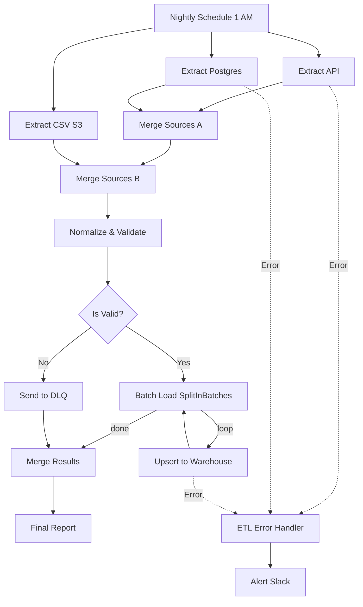

# Multi-Source ETL Pipeline for Data Warehouse (with Dead-Letter Queue)


> Project 48 of the n8n Enterprise practice series
> A production-oriented ETL pipeline reference that extracts from three heterogeneous sources, normalizes and validates data, loads valid records into a Data Warehouse, and routes invalid records to a Dead-Letter Queue

---

## Table of Contents
- [Architecture](#architecture)
- [Features](#features)
- [Prerequisites](#prerequisites)
- [Project Structure](#project-structure)
- [Database Setup](#database-setup)
- [Workflow Descriptions](#workflow-descriptions)
- [ETL Stages](#etl-stages)
- [Idempotency](#idempotency)
- [Testing](#testing)
- [Troubleshooting](#troubleshooting)
- [Security Notes](#security-notes)

---

## Architecture



---

## Features

- Three heterogeneous sources: external API, operational PostgreSQL, and CSV (S3)
- Schema normalization into a unified customer model
- Field-level validation with detailed error reasons
- Dead-Letter Queue (DLQ) for invalid records — pipeline never stops on bad data
- Batch loading with `SplitInBatches` to protect the warehouse
- Idempotent upserts (`ON CONFLICT DO UPDATE`) — safe to re-run
- Final ETL report with loaded vs. DLQ counts
- Dedicated Error Handler workflow with Slack alerting

---

## Prerequisites

- n8n instance (self-hosted recommended)
- PostgreSQL instance for the Data Warehouse and operational DB
- Slack workspace with incoming webhook
- Credentials configured in n8n for PostgreSQL

---

## Project Structure

```text
48-etl-data-warehouse/
├── workflows/
│   ├── main-etl-pipeline.json       # Main ETL workflow (Extract-Transform-Load-DLQ)
│   └── etl-error-handler.json       # Critical error handling workflow
├── sql/
│   └── init.sql                     # Creates warehouse + DLQ + operational tables
├── README.md                        # This file
├── .gitignore
└── .env.example
```

---

## Database Setup

Run the initialization script against your PostgreSQL instance:

```bash
psql -U postgres -f sql/init.sql
```

This creates:
- `warehouse.customers` — the target Data Warehouse table
- `warehouse.dead_letter_queue` — the DLQ table for invalid records
- `ops.customers` — a sample operational source table with test data

---

## Workflow Descriptions

### 1. Multi-Source ETL Pipeline

| Node | Type | Purpose |
|---|---|---|
| Nightly Schedule | Schedule Trigger | Runs the pipeline daily at 1 AM |
| Extract API | HTTP Request | Pulls customer data from an external API |
| Extract Postgres | Postgres | Reads operational customers |
| Extract CSV (S3) | Code | Simulates reading CSV rows from S3 |
| Merge Sources A/B | Merge | Combines the three source streams |
| Normalize & Validate | Code | Maps fields to a unified schema and validates |
| Is Valid? | IF | Routes valid records to load, invalid to DLQ |
| Batch Load | SplitInBatches | Loads records in batches of 100 |
| Upsert to Warehouse | Postgres | Idempotent insert/update into warehouse |
| Send to DLQ | Postgres | Stores invalid records with error reasons |
| Merge Results | Merge | Combines load and DLQ outcomes |
| Final Report | Code | Produces the ETL summary |

### 2. ETL Error Handler

| Node | Type | Purpose |
|---|---|---|
| Error Trigger | Error Trigger | Captures pipeline failures |
| Format Error | Code | Extracts error details |
| Alert Slack | HTTP Request | Sends critical alert |
| Log Error | Code | Writes error to log |

---

## ETL Stages

### Extract
Three sources run in parallel and are merged into a single stream. Each source uses a different field naming convention to demonstrate normalization.

### Transform
The `Normalize & Validate` node maps:
- `id` / `customer_id` / `userId` → `id`
- `name` / `full_name` / `username` → `name`
- `email` / `email_address` → `email`

Validation rules:
- `id` must exist
- `name` must exist
- `email` must match a valid email pattern

Failures produce `valid=false` and an `errorReason`.

### Load
Valid records are loaded in batches via an idempotent upsert. Invalid records go to the DLQ with their raw payload and error reason preserved.

---

## Idempotency

The upsert uses:

```sql
ON CONFLICT (id) DO UPDATE SET ...
```

This means re-running the pipeline (or overlapping runs) never creates duplicate rows; it simply refreshes existing records. This is essential for reliable, re-runnable ETL.

---

## Testing

### Manual Test
1. Import both workflows.
2. Set the Error Workflow ID on the main pipeline.
3. Click **Execute Workflow** on the main pipeline.
4. Verify:
   - Valid records appear in `warehouse.customers`
   - Invalid records appear in `warehouse.dead_letter_queue`
   - The Final Report shows correct counts

### Verify DLQ

```sql
SELECT error_reason, COUNT(*) FROM warehouse.dead_letter_queue GROUP BY error_reason;
```

### Re-run Idempotency Check

Run the pipeline twice and confirm `warehouse.customers` row count does not double.

---

## Troubleshooting

| Issue | Solution |
|---|---|
| Extract Postgres fails | Verify PostgreSQL credentials and that `ops.customers` exists |
| Upsert fails | Ensure `warehouse.customers` table exists and credentials have write access |
| DLQ empty but expected records | Check validation logic; inspect `errorReason` in the Normalize node output |
| Error Handler not firing | Confirm Error Workflow ID is set in the main pipeline settings |
| Slack alert not sent | Verify `SLACK_WEBHOOK_URL` is valid |

---

## Security Notes

- Never commit `.env` or database credentials to version control.
- Use a dedicated DB user with minimal privileges for the ETL pipeline.
- The DLQ stores raw records; treat it as sensitive data and restrict access.
- Enable TLS for all database connections in production.

---

## Notes

- This project demonstrates Enterprise ETL and DLQ patterns.
- For very large datasets, increase batch size tuning and consider incremental (CDC) extraction.
- Combine with Project 42 (backup) and Project 43 (monitoring) for full data-platform resilience.

---

Repository: https://github.com/kooroosh1363/agentic-automation-lab
Author: kooroosh1363
Date: 2026

## Engineering Evidence

- [Business problem, architecture, data flow, security, trade-offs, and production readiness](docs/engineering-evidence.md)
- [Sample input](examples/sample-input.json) and [sample output](examples/sample-output.json)
- [Test and failure scenarios](tests/test-cases.json)

The evidence pack explains the distinction between record-level DLQ handling and technical workflow failure, plus the limits of at-least-once processing and idempotent upsert.
