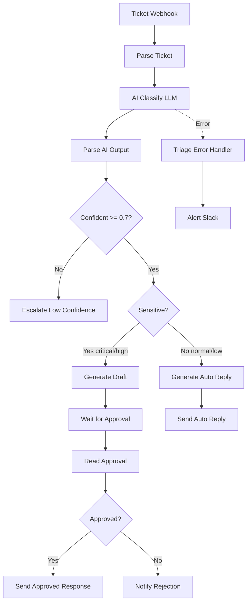

# AI Ticket Triage & Smart Response System


> Project 49 of the n8n Enterprise practice series
> An intelligent support-ticket pipeline that classifies tickets with an LLM, routes by priority, auto-answers routine tickets, and requires human approval for sensitive ones

---

## Table of Contents
- [Architecture](#architecture)
- [Features](#features)
- [Prerequisites](#prerequisites)
- [Project Structure](#project-structure)
- [Workflow Descriptions](#workflow-descriptions)
- [AI Classification Schema](#ai-classification-schema)
- [Human-in-the-Loop](#human-in-the-loop)
- [Confidence Threshold & Fallback](#confidence-threshold--fallback)
- [Testing](#testing)
- [Troubleshooting](#troubleshooting)
- [Security Notes](#security-notes)

---

## Architecture



---

## Features

- LLM-based ticket classification (priority, category, sentiment, confidence)
- Confidence threshold with automatic human escalation on low confidence
- Priority-aware routing: sensitive tickets require human approval
- Automatic replies for routine (normal/low) tickets
- Human-in-the-Loop via the Wait node with a resume webhook
- Robust JSON parsing of LLM output with safe fallbacks
- Dedicated Error Handler workflow with Slack alerting

---

## Prerequisites

- n8n instance (self-hosted recommended)
- OpenAI API key (or any compatible LLM endpoint)
- Slack workspace with incoming webhook
- A ticketing system API endpoint (for sending replies)

---

## Project Structure

```text
49-ai-ticket-triage/
├── workflows/
│   ├── ai-ticket-triage.json        # Main triage + response workflow
│   └── triage-error-handler.json    # Error handling workflow
├── screenshots/                     # Project screenshots
├── README.md                        # This file
├── .gitignore
└── .env.example
```

---

## Workflow Descriptions

### 1. AI Ticket Triage & Smart Response

| Node | Type | Purpose |
|---|---|---|
| Ticket Webhook | Webhook | Receives new tickets via POST |
| Parse Ticket | Code | Normalizes the incoming payload |
| AI Classify | HTTP Request | Sends ticket to LLM for classification |
| Parse AI Output | Code | Safely parses LLM JSON and computes `sensitive` flag |
| Confident? | IF | Checks confidence >= 0.7 |
| Escalate Low Confidence | HTTP Request | Sends low-confidence tickets to humans |
| Sensitive? | IF | Routes critical/high vs normal/low |
| Generate Draft (Sensitive) | HTTP Request | LLM drafts a reply for approval |
| Wait for Approval | Wait | Pauses until a human approves via webhook |
| Read Approval | Code | Normalizes the approval decision |
| Approved? | IF | Routes approved vs rejected |
| Send Approved Response | HTTP Request | Posts the approved reply |
| Notify Rejection | HTTP Request | Alerts agent on rejection |
| Generate Auto Reply | HTTP Request | LLM writes a routine reply |
| Send Auto Reply | HTTP Request | Posts the automatic reply |

### 2. Triage Error Handler

| Node | Type | Purpose |
|---|---|---|
| Error Trigger | Error Trigger | Captures pipeline failures |
| Format Error | Code | Extracts error details |
| Alert Slack | HTTP Request | Sends critical alert |
| Log Error | Code | Writes error to log |

---

## AI Classification Schema

The classifier is instructed to return ONLY this JSON:

```json
{
  "priority": "critical | high | normal | low",
  "category": "billing | technical | account | other",
  "sentiment": "positive | neutral | negative",
  "confidence": 0.0
}
```

The `Parse AI Output` node tolerates malformed LLM responses and defaults to `normal` priority with `confidence 0`, which safely routes to human escalation.

---

## Human-in-the-Loop

Sensitive tickets (priority `critical` or `high`) follow this path:

1. LLM generates a draft reply.
2. The `Wait` node pauses the execution and exposes a resume webhook.
3. A human reviews the draft and POSTs `{ "approved": true }` (or `false`) to the resume webhook.
4. The workflow resumes and either sends the reply or notifies the agent.

This ensures AI never sends a sensitive response without human sign-off.

---

## Confidence Threshold & Fallback

- Confidence `>= 0.7`: proceed to priority routing.
- Confidence `< 0.7`: escalate to a human immediately (no AI response sent).
- Malformed LLM output: treated as confidence `0` → human escalation.

This design makes the system fail-safe: when in doubt, a human decides.

---

## Testing

### 1. Send a test ticket

```bash
curl -X POST https://YOUR_N8N/webhook/ai-ticket \
  -H "Content-Type: application/json" \
  -d '{
    "ticket_id": "T-1001",
    "subject": "Cannot access my account",
    "message": "I lost my 2FA device and cannot log in. Please help urgently!",
    "customer_email": "user@example.com"
  }'
```

### 2. Approve a sensitive draft

After the workflow pauses at `Wait for Approval`, POST to the resume webhook:

```bash
curl -X POST https://YOUR_N8N/webhook-waiting/APPROVAL_PATH \
  -H "Content-Type: application/json" \
  -d '{ "approved": true }'
```

### 3. Verify outcomes

- Routine ticket → auto reply sent.
- Sensitive ticket → waits for approval, then sends or rejects.
- Low-confidence ticket → Slack escalation message.

---

## Troubleshooting

| Issue | Solution |
|---|---|
| AI returns invalid JSON | The parser falls back to defaults; check the model and prompt |
| Wait never resumes | Verify the resume webhook URL is reachable and correct |
| Approval not recognized | Ensure the body contains `"approved": true` (boolean or string) |
| Slack alert not sent | Verify `SLACK_WEBHOOK_URL` is valid |
| Error Handler not firing | Confirm Error Workflow ID is set in the main workflow settings |

---

## Security Notes

- Never commit `.env` or API keys to version control.
- Treat LLM outputs as untrusted; always validate before acting.
- Require authentication on the approval webhook in production.
- Log and audit all AI-sent responses for compliance.

---

## Notes

- This project demonstrates Enterprise AI-orchestration and Human-in-the-Loop patterns.
- Swap the OpenAI endpoint for any compatible LLM (self-hosted or cloud).
- Combine with Project 43 (monitoring) to track triage latency and confidence distribution.

---

Repository: https://github.com/kooroosh1363/agentic-automation-lab
Author: kooroosh1363
Date: 2026

## Engineering Evidence

- [Business problem, architecture, data flow, security, trade-offs, and production readiness](docs/engineering-evidence.md)
- [Sample input](examples/sample-input.json) and [sample output](examples/sample-output.json)
- [Test and failure scenarios](tests/test-cases.json)

Malformed AI output now receives confidence zero and is forced to human review. Approval processing also preserves the original ticket and triage context for downstream actions and auditability.
