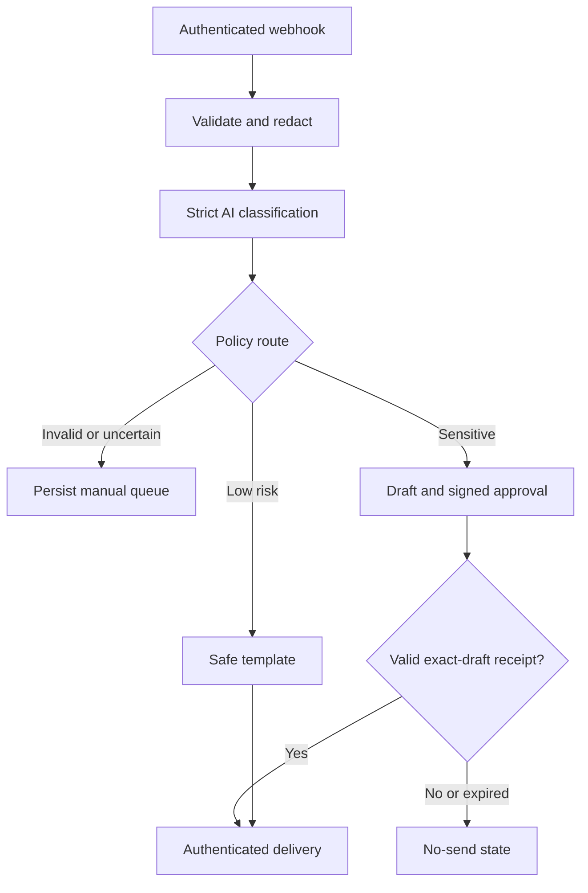

# AI Ticket Triage with Controlled Automation


An n8n reference implementation for authenticated ticket intake, strict LLM classification, deterministic risk routing, bounded automatic replies, signed exact-draft approval, durable manual-review state, and tamper-evident audit receipts.

This project deliberately separates **model judgment** from **action authority**. The LLM can propose classification and draft text, but deterministic policy decides whether automation is allowed. Low-confidence, malformed, provider-failed, financial, account, security, cancellation, legal, privacy, and other sensitive cases cannot reach an automatic generated response.

## Business problem

Ticket automation can reduce response time, but a fluent LLM response is not evidence that an action is safe. A production-minded design must handle malformed output, prompt injection, duplicate delivery, unavailable providers, sensitive categories, approval expiry, and audit failure without silently answering a customer.

This reference implements four explicit outcomes:

1. reject an unauthenticated or invalid intake;
2. persist low-confidence and failed classifications in a manual queue;
3. send only a bounded, non-factual template for valid low-risk cases;
4. block sensitive drafts until a signed callback approves the exact draft.

## Architecture



Every protected decision and successful delivery is written to a local append-only audit sink. External requests use bounded timeouts and retries. Customer delivery uses an action-specific idempotency key.

## Trust boundaries

| Boundary | Enforced control | Failure behavior |
|---|---|---|
| Ticket intake | Shared-secret header, required fields, bounded values, ID and email validation | `REJECTED_INTAKE`; no model call |
| Model input | Email, phone, and payment-number redaction; ticket marked as untrusted data | Minimized payload sent to classifier |
| Classification | Full enum and confidence schema validation | Manual queue |
| Risk decision | Deterministic category, keyword, priority, and sentiment policy | Sensitive approval route |
| Provider failure | Connected error outputs for classification and drafting | Persisted manual queue |
| Automatic reply | Versioned, bounded template; no free-form LLM generation | Ticket remains open |
| Human authority | SHA-256 draft hash, HMAC callback token, reviewer field, expiry | Rejected or expired; no send |
| Ticket API | Bearer token, timeout, retry, non-empty reply, idempotency key | Workflow fails; no false success |
| Audit | Authenticated append-only hash chain | Protected step does not continue |
| Global failure | Redacted durable receipt before Slack alert | Inspectable incident record |

## Routing policy

The classifier must return:

```json
{
  "priority": "critical | high | normal | low",
  "category": "billing | technical | account | cancellation | security | other",
  "sentiment": "positive | neutral | negative",
  "confidence": 0.0
}
```

The output is valid only when **every** field matches its schema and confidence is within `0..1`. Invalid enums are not converted into an apparently valid default classification.

| Condition | Route |
|---|---|
| Provider error, malformed JSON, invalid enum, or confidence below threshold | `MANUAL_REVIEW` |
| Billing, account, cancellation, security, high/critical, negative, or sensitive keyword | `APPROVAL_REQUIRED` |
| Valid high-confidence technical/other ticket without deterministic risk signals | `AUTO_TEMPLATE` |

`TRIAGE_CONFIDENCE_THRESHOLD=0.70` is an initial operating value, not a calibrated probability claim. Tune it using a labeled dataset, per-class precision/recall, unsafe-action rate, and manual workload.

## Human approval

Sensitive cases produce a cautious draft that explicitly avoids promising refunds, security outcomes, deadlines, or completed actions. The workflow then:

1. canonicalizes ticket ID, recipient, subject, and body;
2. calculates the exact draft's SHA-256 hash;
3. signs execution ID, ticket ID, hash, and expiry with HMAC-SHA256;
4. persists `APPROVAL_REQUIRED` and an audit receipt;
5. sends the draft, hash, token, expiry, and n8n resume URL to a restricted Slack channel;
6. waits for a bounded number of hours;
7. validates token, hash, reviewer, decision, and expiry;
8. persists the decision before evaluating the send branch.

See [approval callback contract](docs/approval-contract.md).

## Safe automatic replies

The automatic path does not ask an LLM to invent a customer-facing answer. It uses versioned templates for low-risk technical and general requests. The templates only acknowledge receipt, keep the case open, and request non-sensitive diagnostic detail. They do not claim that a refund, account operation, fix, or deadline has been completed.

## Error handling

Classification and sensitive-draft HTTP nodes expose two connected outputs:

- success continues to validation;
- provider failure constructs a safe failure record and enters the durable manual queue.

Unhandled workflow failures are handled by `triage-error-handler.json`. It redacts common secrets and PII, classifies severity, persists the failure receipt, and only then sends the Slack alert.

n8n assigns workflow IDs during import. Follow [the import checklist](docs/import-checklist.md) to select the error workflow after import. The repository intentionally contains no fake placeholder ID.

## State model

```text
RECEIVED
  → REJECTED_INTAKE
  → TRIAGED
      → NEEDS_REVIEW
      → AUTO_REPLY_READY → SENT
      → APPROVAL_REQUIRED → APPROVED → SENT
                          → REJECTED
                          → EXPIRED
```

## Project structure

```text
49-ai-ticket-triage/
├── docs/
│   ├── approval-contract.md
│   ├── engineering-evidence.md
│   ├── import-checklist.md
│   ├── threat-model.md
│   └── ticket-api-contract.md
├── examples/
│   ├── sample-input.json
│   └── sample-output.json
├── scripts/
│   ├── audit-server.mjs
│   ├── build-workflows.mjs
│   └── ticket-server.mjs
├── src/
│   └── policy.mjs
├── tests/
│   ├── policy.test.mjs
│   ├── ticket-server.test.mjs
│   ├── test-cases.json
│   └── validate-workflows.mjs
├── workflows/
│   ├── ai-ticket-triage.json
│   └── triage-error-handler.json
├── .env.example
├── package.json
└── README.md
```

## Local verification

Requirements: Node.js 20 or later. There are no runtime npm dependencies.

```bash
npm test
```

The test command deterministically regenerates both workflows, validates their graphs and Code-node syntax, and runs policy and local-adapter tests. The generated main workflow contains 32 connected nodes and the error workflow contains four. The suite covers:

- webhook authentication and input validation;
- PII minimization;
- malformed JSON and invalid enum fail-closed behavior;
- low-confidence manual escalation;
- deterministic override of a prompt-injected low-risk label;
- safe-template eligibility;
- exact-draft hash, HMAC token, reviewer, and expiry;
- rejected/no-send graph isolation;
- connected provider-failure outputs;
- audit authentication and hash-chain linkage;
- ticket API authentication, non-empty replies, idempotent replay, and conflict detection.

The CI workflow runs the same suite and fails if regenerating the workflow changes the committed JSON.

## Local reference services

The two included adapters use only Node.js built-ins and local append-only files.

```bash
# Terminal 1
set -a && source .env && set +a
npm run audit:start

# Terminal 2
set -a && source .env && set +a
npm run ticket:start
```

Health checks:

```bash
curl http://127.0.0.1:8788/health
curl http://127.0.0.1:8789/health
```

The ticket server is a reproducible local adapter, not a full help-desk product. Its on-disk idempotency index demonstrates the required contract without a paid service.

## n8n setup

1. Copy `.env.example` to `.env` and replace all placeholder values.
2. Run `npm test`.
3. Start the local audit and ticket services, or configure equivalent external adapters.
4. Import and activate `workflows/triage-error-handler.json`.
5. Import `workflows/ai-ticket-triage.json`.
6. Select the imported error handler in the main workflow settings.
7. expose environment variables to n8n and allow the built-in `crypto` module.
8. restrict the Slack review webhook to an authorized channel.
9. activate the workflow and exercise all routes before connecting customer traffic.

Sample request:

```bash
curl -X POST https://YOUR_N8N/webhook/ai-ticket-v2 \
  -H "Content-Type: application/json" \
  -H "X-Triage-Secret: $TICKET_WEBHOOK_SECRET" \
  --data @examples/sample-input.json
```

The webhook acknowledges accepted transport with HTTP `202`; the durable ticket state and audit receipt are the sources of truth for processing outcomes.

## Security and privacy notes

- Keep webhook, approval, ticket, audit, and provider secrets independent.
- Never commit `.env`, audit logs, ticket data, or n8n credentials.
- Expose the local services only on a trusted internal network.
- Treat Slack resume URLs and callback tokens as short-lived secrets.
- The redactor covers common patterns, not every possible identifier; apply organization-specific DLP before live traffic.
- n8n execution storage may contain customer data. Configure retention, encryption, access control, and backups.
- Apply rate limiting, request-size limits, and TLS at the reverse proxy.
- The `reviewer` field is asserted in the reference flow; use SSO or verified Slack identity for a live deployment.

See [threat model](docs/threat-model.md) and [engineering evidence](docs/engineering-evidence.md).

## Engineering Evidence

- [Business problem, architecture, data flow, test cases, failure behavior, security, trade-offs, and production-readiness evidence](docs/engineering-evidence.md)
- [Sample input](examples/sample-input.json) and [sample output](examples/sample-output.json)
- [Machine-readable test and failure scenarios](tests/test-cases.json)

## Production-readiness boundary

This repository is a **production-oriented reference implementation**, not a turnkey production system. Before live rollout, add:

- an organization-specific labeled evaluation dataset and confidence calibration;
- verified reviewer identity through SSO or signed Slack interactions;
- a real ticketing adapter with database constraints and delivery receipts;
- organization-specific DLP, retention, tenant isolation, and authorization rules;
- provider rate-limit, cost, latency, and response-quality monitoring;
- staging import tests against the exact n8n version used in deployment;
- backup, restoration, and independent audit-chain verification.

## License

This project is proprietary and intended for internal use or authorized clients. © 2026.
