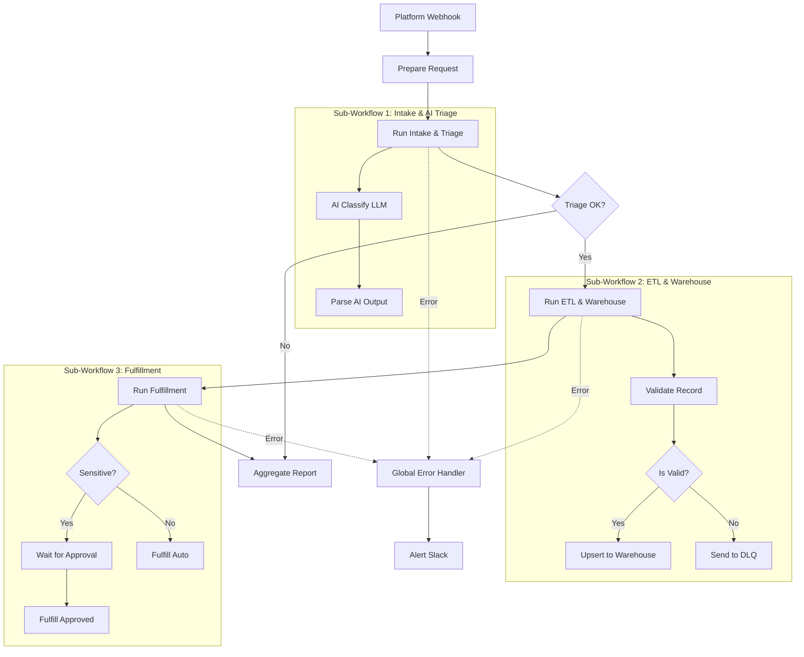

 Enterprise Automation Platform (Capstone)

> Project 50 — the final capstone of the n8n Enterprise practice series
> A unified automation platform that combines every concept from Projects 1–49:
> orchestration, AI triage, ETL with DLQ, human-in-the-loop, observability, and infrastructure-as-code

---

## Table of Contents
- [Architecture](#architecture)
- [Features](#features)
- [Prerequisites](#prerequisites)
- [Project Structure](#project-structure)
- [Start the Platform](#start-the-platform)
- [Workflow Descriptions](#workflow-descriptions)
- [How Orchestration Works](#how-orchestration-works)
- [Data Flow](#data-flow)
- [Testing](#testing)
- [Troubleshooting](#troubleshooting)
- [Security Notes](#security-notes)
- [Series Retrospective](#series-retrospective)

---

## Architecture



---

## Features

- **Master Orchestrator** that coordinates three sub-workflows via `Execute Workflow`
- **AI Triage** sub-workflow (LLM classification with confidence scoring)
- **ETL & Warehouse** sub-workflow with validation and Dead-Letter Queue
- **Fulfillment** sub-workflow with Human-in-the-Loop approval for sensitive cases
- **Global Error Handler** shared by all workflows
- **Infrastructure as Code**: single `docker-compose` for n8n + PostgreSQL + Prometheus + Grafana
- Idempotent upserts, fail-safe escalation, and platform-level reporting

---

## Prerequisites

- Docker Engine 24.0+ and Docker Compose 2.20+
- OpenAI API key (or compatible LLM endpoint)
- Slack workspace with incoming webhook
- An action/fulfillment API endpoint

---

## Project Structure

```text
50-enterprise-automation-platform/
├── workflows/
│   ├── master-orchestrator.json      # Parent orchestrator
│   ├── sub-intake-ai-triage.json     # Child 1: AI triage
│   ├── sub-etl-warehouse.json        # Child 2: ETL + DLQ
│   ├── sub-fulfillment.json          # Child 3: action + approval
│   └── global-error-handler.json     # Shared error handler
├── infrastructure/
│   └── docker-compose.yml            # Full platform stack
├── screenshots/
├── README.md                         # This file
├── .gitignore
└── .env.example
```

---

## Start the Platform

### 1. Configure environment

```bash
cp .env.example .env
# Edit .env with your values
```

### 2. Launch the stack

```bash
cd infrastructure
docker compose up -d
```

Services:
- n8n: http://localhost:5678
- Prometheus: http://localhost:9090
- Grafana: http://localhost:3000

### 3. Import workflows and wire IDs

1. Import the four sub/parent workflows plus the error handler.
2. Copy each sub-workflow's ID.
3. In `master-orchestrator.json`, replace:
   - `SUB_INTAKE_AI_TRIAGE_ID`
   - `SUB_ETL_WAREHOUSE_ID`
   - `SUB_FULFILLMENT_ID`
   - `GLOBAL_ERROR_HANDLER_ID`
4. Activate the Master Orchestrator.

---

## Workflow Descriptions

### Master Orchestrator (Parent)

| Node | Purpose |
|---|---|
| Platform Webhook | Entry point for all requests |
| Prepare Request | Normalizes the payload and assigns a requestId |
| Run Intake & Triage | Calls Child 1 and waits for the result |
| Triage OK? | Gates the pipeline on confidence >= 0.7 |
| Run ETL & Warehouse | Calls Child 2 |
| Run Fulfillment | Calls Child 3 |
| Aggregate Report | Combines stage outputs into a final report |

### Child 1: Intake & AI Triage
Classifies the request with an LLM and returns `priority`, `category`, `confidence`, and `sensitive`.

### Child 2: ETL & Warehouse
Validates the record; valid records are upserted into `warehouse.requests`, invalid ones go to the DLQ.

### Child 3: Fulfillment
Sensitive requests wait for human approval; routine requests are fulfilled automatically.

### Global Error Handler
Captures failures from any workflow, formats them, alerts Slack, and logs.

---

## How Orchestration Works

- The parent uses `Execute Workflow` with `waitForSubWorkflow: true`, so it blocks until each child finishes and receives the child's output as its own input.
- Each child starts with an `Execute Workflow Trigger`, receiving the parent's payload.
- This Parent/Child design keeps workflows modular, testable, and reusable — the opposite of a monolithic workflow.

---

## Data Flow

```text
Webhook → Prepare → [Child1: classify] → gate → [Child2: store/DLQ] → [Child3: fulfill] → Report
```

Every stage appends its summary, so the final `Aggregate Report` contains a complete audit trail.

---

## Testing

Send a test request:

```bash
curl -X POST https://YOUR_N8N/webhook/platform \
  -H "Content-Type: application/json" \
  -d '{
    "request_id": "REQ-500",
    "channel": "web",
    "subject": "Enterprise onboarding",
    "message": "We need to onboard 200 employees next week.",
    "customer_email": "hr@company.com"
  }'
```

Verify:
- Child 1 returns a classification.
- Child 2 stores the record (or DLQs it).
- Child 3 fulfills (waiting for approval if sensitive).
- The Master returns an aggregated report.

---

## Troubleshooting

| Issue | Solution |
|---|---|
| Sub-workflow not called | Verify the workflow IDs are correctly replaced in the parent |
| Child returns nothing | Ensure `waitForSubWorkflow: true` and the child has an Execute Workflow Trigger |
| DLQ receives valid records | Check the validation regex and required fields |
| Approval never resumes | Confirm the Wait resume webhook URL is reachable |
| Stack fails to start | Check `.env` values and that ports 5678/9090/3000 are free |

---

## Security Notes

- Never commit `.env`; it contains DB and API secrets.
- Use least-privilege DB users for n8n and the ETL stage.
- Require authentication on all public webhooks in production.
- Treat LLM output as untrusted; validate before acting.

---

## Series Retrospective

Across 50 projects you built:

| Category | Skills |
|---|---|
| Fundamentals | Webhooks, HTTP, Code, IF/Switch, Merge, loops |
| Data & Storage | PostgreSQL, ETL, DLQ, idempotent upserts |
| Reliability | Error handlers, retries, exponential backoff, rate limiting |
| Infrastructure | Docker, backup/restore, Prometheus, Grafana |
| Development | Custom nodes & triggers in TypeScript, npm publishing |
| Intelligence | LLM classification, generation, human-in-the-loop |
| Architecture | Parent/Child orchestration, platform design |

This capstone ties them all into a single, production-grade platform.

---

Repository: https://github.com/kooroosh1363/n8n-workflows-practice
Author: kooroosh1363
Date: 2026